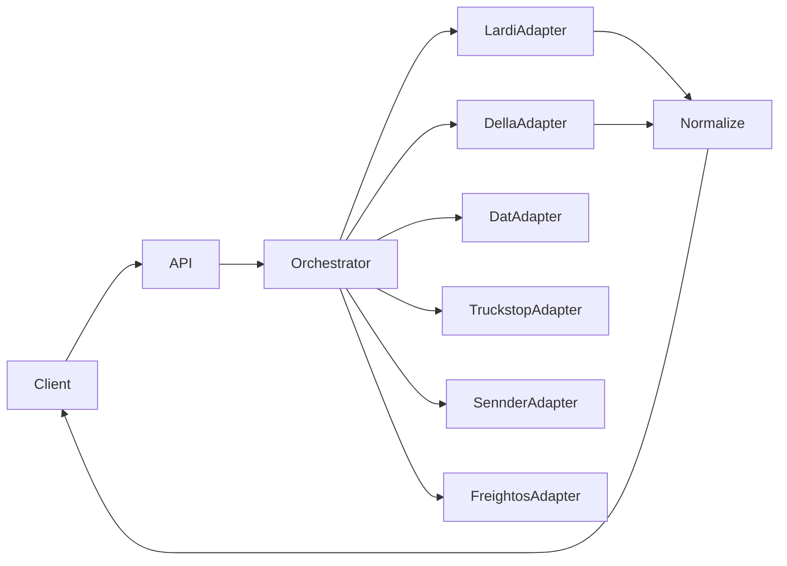

# Mimari

```
apps/api          → HTTP, Nest modülleri, DI
core/             → Domain tipleri, exception’lar, port arayüzleri
```

## Modül haritası

| Nest modülü | Sorumluluk |
|-------------|------------|
| `LocalizationModule` | i18n, locale çözümleme |
| `SubscriptionModule` | Modüler plan, entitlement kontrolü |
| `IntegrationModule` | Harici provider adapter’ları |
| `MarketplaceModule` | İlan + arama (platform içi) |
| `IdentityModule` | Kullanıcı/şirket iskeleti |

## Entegrasyon akışı



Her adapter yalnızca kendi provider exception’ını fırlatır; orchestrator bunları `IntegrationProviderFailure` olarak toplar.

## Abonelik

Entitlement kontrolü servis katmanında; controller ince kalır. Modül kodları `core/constants/SubscriptionModuleCode.ts` içinde tek kaynak.
