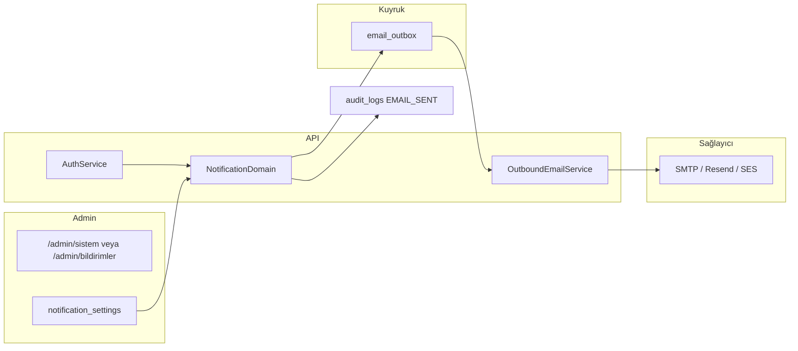

# E-posta ve yönetici bildirim sistemi — teknik rapor (v0)

**Kapsam:** Platform yöneticisi (admin) ve operasyon ekibinin kullanacağı e-posta altyapısı; öncelik **kayıt**, **ilk giriş**, **giriş güvenliği** ve kullanıcı bilgilendirme akışları.  
**Tarih:** 2026-09-24  
**Repo durumu:** SMTP/transactional e-posta sağlayıcısı **yok**; profil bildirim tercihleri **localStorage**; audit log HTTP isteklerini kaydediyor; `user_accounts` tablosunda `lastLoginAt` / `emailVerified` alanları **yok**.

---

## 1. Amaç ve başarı kriterleri

| Hedef | Ölçü |
|--------|------|
| Yeni firma kaydı admin’e anında görünür | Medyan gecikme &lt; 2 dk (kuyruk + SMTP) |
| İlk kullanıcı girişi izlenebilir | Admin e-postası + `/admin` audit satırı |
| Kullanıcı güveni | Kayıt onayı, şüpheli giriş uyarısı (opsiyonel faz) |
| KVKK / opt-out | Pazarlama ayrı; transactional zorunlu bildirimler açık |
| Operasyon | Şablonlar admin’den düzenlenebilir (faz 2); gönderim logları |

---

## 2. Mevcut sistem özeti (gap analizi)

### 2.1 Kimlik ve oturum

- **Kayıt:** `POST /auth/register` → firma + `COMPANY_OWNER` + starter abonelik (`UserCredentialAuthenticationService.registerCompanyOwner`).
- **Giriş:** `POST /auth/login` → JWT; **e-posta gönderilmez**, **ilk giriş** ayrımı yapılmaz.
- **Oturum:** JWT `sub`, `companyId`, `emailAddress`, `roleCodes` — süre `JWT_EXPIRES_IN` (varsayılan 12h).
- **Platform admin:** `admin@nakliyeborsasi.local` (seed); web’de operatör bandı + yönetim konsolu.

### 2.2 Bildirimler (ürün)

- **Profil:** `notifyNewOffers`, `notifyMessages`, `notifyAuctions`, `notifyWeeklyDigest` — yalnızca tarayıcıda (`nb-user-profile:*`), API’ye bağlı değil.
- **Organizasyon:** `emailVerified` demo bayrağı (`nb-organization-admin:*`), gerçek doğrulama akışı yok.

### 2.3 Denetim

- `audit_logs`: her HTTP isteği `HTTP_REQUEST` (giriş sonrası JWT ile `actorUserId` dolu).
- **Eksik:** `AUTH_LOGIN_SUCCESS`, `AUTH_LOGIN_FAILED`, `AUTH_REGISTER`, `AUTH_FIRST_LOGIN` action kodları; IP / user-agent metadata.

### 2.4 E-posta altyapısı

- Kod tabanında **MailModule**, şablon motoru, kuyruk (Bull/Redis) **bulunmuyor**.
- Faz planı (`docs/PHASES.md`): WebSocket/push Faz 8; e-posta açıkça planlanmamış — bu rapor Faz 3.x–6 arası önerilen **paralel iş paketi**.

---

## 3. Paydaşlar ve e-posta türleri

| Alıcı | Tür | Örnek |
|--------|-----|--------|
| **Platform admin(ler)** | Operasyonel | Yeni kayıt, ilk giriş, başarısız giriş patlaması |
| **Firma sahibi** | Transactional | Kayıt alındı, e-posta doğrulama, şifre sıfırlama |
| **Çalışan** (gelecek) | Davet | Davet linki, rol ataması |
| **Fatura yöneticisi** | Transactional | Ödeme / fatura (ödemeler modülü) |

**Transactional vs pazarlama:** Kayıt/giriş/ güvenlik = transactional (554/ KVKK aydınlatma metni ile). Haftalık özet = kullanıcı opt-in (profil toggles → API).

---

## 4. Olay kataloğu (öncelik sırası)

### Faz A — Kayıt ve ilk giriş (sizin öncelik)

| Kod | Tetikleyici | Kullanıcı e-postası | Admin e-postası |
|-----|-------------|---------------------|-----------------|
| `USER_REGISTERED` | `register` başarılı | Hoş geldin + sonraki adımlar (doğrulama, organizasyon) | **Yeni üye:** firma, ülke, tip, web, e-posta, plan |
| `USER_FIRST_LOGIN` | İlk başarılı `login` (`lastLoginAt` null → set) | “Hesabınız aktif” + kısa rehber (marketplace / organizasyon) | **İlk giriş:** kullanıcı, firma, zaman, IP (kısaltılmış), cihaz özeti |
| `USER_LOGIN` | Her başarılı login (opsiyonel) | Kapalı varsayılan veya “yeni cihaz” koşullu | Günlük özet veya kapalı (spam riski) |
| `USER_LOGIN_FAILED` | Yanlış şifre (rate limit sonrası) | — | Eşik aşımında (ör. 10/15 dk / IP) uyarı |

### Faz B — Güvenlik

| Kod | Tetikleyici |
|-----|-------------|
| `PASSWORD_RESET_REQUESTED` | Şifre sıfırlama (henüz API yok) |
| `PASSWORD_CHANGED` | Şifre değişti |
| `EMAIL_VERIFICATION` | Doğrulama linki |
| `ACCOUNT_LOCKED` | Admin dondurma (`accountFrozen`) |

### Faz C — İş olayları (sonra)

İlan, ihale, mesaj, abonelik, ödeme — profil bildirim tercihleri ile birleşir.

---

## 5. “İlk giriş” tanımı (net kurallar)

1. **İlk giriş** = `user_accounts.first_login_at` ilk kez set edildiği `login` (kayıt anında otomatik giriş yapılırsa: kayıt = ilk oturum, **aynı event** veya `USER_REGISTERED` + token; ikinci ziyaret `USER_FIRST_LOGIN` sayılmaz — ürün kararı).
2. **Öneri:** Kayıtta e-posta gönder, **ilk ayrı `login`** (farklı oturum) için ayrı admin bildirimi — operasyon “gerçekten platforma döndü mü?” sorusunu cevaplar.
3. **Firma bazlı ilk giriş:** `companies.first_member_login_at` — admin’de “yeni firma aktivasyonu” KPI.

---

## 6. Yönetici mail sistemi — mimari

### 6.1 Bileşenler

| Bileşen | Sorumluluk |
|---------|------------|
| `NotificationModule` | Olay dinleme, şablon seçimi, alıcı listesi |
| `EmailTemplateService` | TR/EN/UK/RU; değişkenler `{{displayName}}`, `{{companyLegalName}}` |
| `AdminRecipientResolver` | `PLATFORM_ADMIN_EMAILS` env + DB `platform_notification_settings` |
| `EmailOutboxEntity` | idempotency key, status, provider message id, hata |
| `EmailWebhookController` | Bounce/complaint (sağlayıcıdan) |

### 6.2 Veri modeli (öneri)

**`user_accounts`**

- `emailVerifiedAt`, `lastLoginAt`, `firstLoginAt`, `loginCount`
- `preferredLocale` (profil ile senkron)

**`email_outbox`**

- `eventCode`, `recipientEmail`, `templateCode`, `locale`, `payloadJson`, `status`, `scheduledAt`, `sentAt`, `idempotencyKey`

**`platform_notification_settings`**

- `eventCode`, `enabled`, `adminEmails[]`, `userEmailEnabled`, `throttleMinutes`

### 6.3 Admin UI (yönetici kullanımı)

Yeni modül: **Admin → Bildirimler / E-posta** (veya Sistem alt sekmesi):

- Olay listesi (toggle: admin’e / kullanıcıya)
- Alıcı listesi (virgülle e-posta; `security@`, `ops@`)
- Test gönder (“Örnek: USER_FIRST_LOGIN”)
- Son 100 gönderim + hata
- Şablon önizleme (HTML + düz metin)

Mevcut `/admin/sistem` overview’a KPI: “Bugün kayıt / ilk giriş”.

---

## 7. Şablon içerikleri (ilk faz taslağı)

### 7.1 Kullanıcı — kayıt (`USER_REGISTERED`)

- **Konu (TR):** `Nakliye Borsası — kaydınız alındı`
- **İçerik:** Hoş geldin, firma adı, sonraki adımlar (organizasyon profili, doğrulama), destek linki, yasal dipnot (KVKK).
- **CTA:** `Benim organizasyonum` deep link.

### 7.2 Kullanıcı — ilk giriş (`USER_FIRST_LOGIN`)

- **Konu:** `İlk girişiniz tamamlandı`
- **İçerik:** Marketplace / yük arama ipucu; güvenlik: şifrenizi kimseyle paylaşmayın.

### 7.3 Admin — yeni kayıt

- **Konu:** `[NB] Yeni firma kaydı — {{companyLegalName}}`
- **Tablo:** e-posta, ülke, participant type, web, plan, userId, companyId, zaman (UTC+3).
- **CTA:** `/admin/organizasyon?firma={{companyId}}`

### 7.4 Admin — ilk giriş

- **Konu:** `[NB] İlk giriş — {{emailAddress}} / {{companyLegalName}}`
- **Risk satırı:** IP, User-Agent (kısaltılmış), önceki kayıt tarihi.

---

## 8. Güvenlik ve uyumluluk

- Şifre / token **asla** e-postada; sadece tek kullanımlık link (TTL 15–60 dk).
- Admin bildirimlerinde tam IP yerine /24 veya hash (KVKK minimizasyonu).
- Başarısız giriş loglarında e-posta enumerate etmeyin (admin’de “bilinmeyen e-posta denemesi”).
- SPF/DKIM/DMARC domain: `mail.nakliyeborsasi.com` veya Resend verified domain.
- Rate limit: kullanıcıya max 5 transactional / saat; admin özet throttle.

---

## 9. Entegrasyon noktaları (kod)

| Dosya / endpoint | Değişiklik |
|------------------|------------|
| `UserCredentialAuthenticationService.registerCompanyOwner` | Transaction commit sonrası `NotificationService.emit(USER_REGISTERED)` |
| `authenticateCredentials` | Başarı → `firstLoginAt` kontrolü → `USER_FIRST_LOGIN` veya `USER_LOGIN` |
| `AuthenticationController` | (opsiyonel) `login` metadata: IP, UA header |
| `HttpRequestAuditLoggingInterceptor` | Auth path’lerde özel `actionCode` (login/register) |
| `apps/web/.../ProfilePageClient` | Bildirim toggles → `PATCH /users/me/notification-preferences` (ileri faz) |
| `.env` | `SMTP_*` veya `RESEND_API_KEY`, `PLATFORM_ADMIN_EMAILS` |

---

## 10. Sağlayıcı seçimi (öneri)

| Seçenek | Artı | Eksi |
|---------|------|------|
| **Resend** | Hızlı kurulum, şablon API | Maliyet ölçekte |
| **Amazon SES** | Ucuz, EU region | Kurulum ağır |
| **Postfix (VPS)** | Tam kontrol | Deliverability, bakım |

**Öneri:** Üretim için Resend/SES; geliştirme için **Mailpit/Mailhog** (Docker) + outbox tablosu.

---

## 11. Uygulama fazları

| Faz | Süre (teknik) | Teslim |
|-----|----------------|--------|
| **A1** | Outbox + Mailpit + 2 admin şablon (kayıt, ilk giriş) | Çalışan pipeline |
| **A2** | `lastLoginAt` / `firstLoginAt` migration + auth hook | Doğru ilk giriş |
| **A3** | Admin UI toggles + test send | Yönetici self-servis |
| **A4** | Kullanıcı kayıt e-postası + TR/EN locale | Üye deneyimi |
| **B** | E-posta doğrulama, şifre sıfırlama | Güvenlik tamamlama |

---

## 12. KPI ve izleme

- Kayıt → ilk giriş oranı (7 gün)
- E-posta delivery rate, bounce rate
- Admin bildirim gecikmesi (p95)
- Grafana/PM2 log: `email_outbox` failed count

---

## 13. Açık ürün kararları (onayınıza sunulur)

1. Kayıt sonrası otomatik JWT ile marketplace’e yönlendirme **ilk giriş** sayılsın mı?
2. Her başarılı girişte admin e-postası **kapalı** mı (yalnızca ilk + kayıt)?
3. Admin alıcıları: tek `ops@` mi, rol bazlı mı?
4. Çoklu dil: admin e-postaları daima TR mi?

---

## 14. Sonuç

Nakliye Borsası’nda **giriş ve kayıt olayları** üretim için hazır; **e-posta katmanı sıfırdan** inşa edilmeli. Öncelikli değer: platform yöneticisinin **yeni firma** ve **ilk gerçek giriş** anlarını e-posta + admin panelinde görmesi; paralelde kullanıcıya **kurumsal hoş geldin** transactional mesajı. Mevcut audit log ve abonelik/organizasyon verisi şablon zenginliği için yeterli; `UserAccountEntity` ve auth servisi minimal migration ile tamamlanır.

**Sonraki adım (implementasyon):** Faz A1 branch — `NotificationModule` + Mailpit + `USER_REGISTERED` / `USER_FIRST_LOGIN` admin şablonları.
