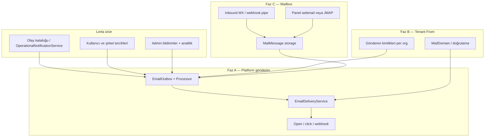

# E-posta platformu stratejisi — Hedef A, B ve C

**Karar (2026-09-24):** Üç hedefin tamamı yapılacak; sıra **A → B (transactional) → C (tam kutu)**.

| Hedef | Tanım | Son kullanıcı görünümü |
|-------|--------|-------------------------|
| **A** | Sadece platform bildirimleri | `notifications@mail.lerta.tr` — kendi VPS MTA (Postfix + OpenDKIM) |
| **B** | Müşteri kimliği ile gönderim | `bildirim@musteri.com` veya `kullanici@lertalogistics.com` (gerçek From; hâlâ **giden bildirim**, tam webmail değil) |
| **C** | Tam mailbox | Gelen + giden, klasörler, yanıt, (isteğe bağlı) IMAP; panel içi veya harici istemci |

Mevcut omurga: `apps/api/src/modules/notification/*`, admin **`/admin/bildirimler`**, F1–F4 (outbox, analitik, politika, kendi SMTP). Harici ESP/Gmail entegrasyonu repoda **yok**. Bu belge **yeni ürün hatlarını** fazlara böler.

---

## 1. Neden bu sıra?

1. **A** deliverability ve operasyonu tek elde toplar (Gmail relay limitleri, marka, webhook tutarlılığı).
2. **B**, A’nın gönderim hattına **tenant/domain** ekler; MX ve depolama zorunlu değil (sadece SPF/DKIM/DMARC + gönderen doğrulama).
3. **C**, B’nin domain/hesap modeline **inbound + depolama + webmail** ekler; en pahalı ve operasyonel riskli katman.

B ve C’yi A tamamlanmadan başlatmak mümkün ama **üretimde tek gönderim kimliği** (A) olmadan B/C DNS karmaşası artar.

---

## 2. Mimari özeti (hedef durum)

**Ayrım:** Faz A–B’de mesajlar **outbox satırı** + ESP/SMTP ile gider. Faz C’de **kalıcı mailbox mesajı** ayrı tabloda; bildirim outbox ile birleşmez (ilişki `relatedOutboxId` ile).

---

## 3. Faz A — Platform bildirimleri (Hedef A)

### 3.1 Ürün kapsamı

- Tüm sistem e-postaları: auth, ihale, ilan, mesaj, admin uyarıları.
- Tek veya az sayıda **platform gönderen** profili.
- Gönderim yalnızca **`mail.lerta.tr`** ve VPS **Postfix** (`SmtpEmailSender`).

### 3.2 Teknik iş listesi

| # | İş | Not |
|---|-----|-----|
| A1 | DNS: SPF, DKIM, DMARC platform domain | VPS / Cloudflare; admin’de “doğrulandı” rozeti |
| A2 | `SMTP_FROM` / varsayılan From platform domain | `docs/PLATFORM_BRANDING.md` ile uyum |
| A3 | Production SMTP doğrulama + suppression | Admin Operasyon |
| A4 | Bounce: SMTP sınıflandırma (Faz C’de inbound webhook) | ESP webhook yok |
| A5 | Admin: gönderim sağlığı, analitik, suppression tam kullanım | `/admin/bildirimler` |
| A6 | `EMAIL_TRACKING_ENABLED` prod kararı + secret rotasyonu | |
| A7 | Runbook: bounce, şikâyet, suppression | `docs/EMAIL_F3_F4_OPERATIONS.md` genişlet |

### 3.3 Başarı kriteri

- %99+ platform bildirimleri `From: notifications@mail.lerta.tr` (veya seçilen platform domain).
- SMTP hataları ve suppression outbox ile uyumlu.
- Gelen kutusu **Faz C** (kendi MX + webmail).

### 3.4 Kod referansları (mevcut)

- `EmailOutboxService`, `EmailOutboxProcessor`, `EmailDeliveryService`
- `SmtpEmailSender`
- `OperationalNotificationService`, `NotificationEventCatalog`

---

## 4. Faz B — Müşteri domain / alt domain ile transactional (Hedef B, 1. kısım)

### 4.1 Ürün kapsamı

- **Organizasyon** kendi domain’ini bağlar (`musteri.com`) **veya** platform alt alanı alır (`firma.lertalogistics.com` → `destek@firma.lertalogistics.com`).
- Sadece **platform tetiklediği** e-postalar bu kimlikle gider (ihale daveti, taşıyıcı bildirimi vb.).
- Tam gelen kutusu **yok**; yanıtlar ya `Reply-To: platform` ya da ileride Faz C.

### 4.2 Veri modeli (öneri)

| Entity | Alanlar (özet) |
|--------|----------------|
| `MailDomainEntity` | `organizationId`, `domain`, `type: custom \| subdomain`, `verificationStatus`, DNS kayıt snapshot |
| `MailSenderIdentityEntity` | `domainId`, `localPart`, `displayName`, `purpose: transactional \| marketing`, `isDefault` |
| `MailDomainDnsCheckEntity` | Son kontrol zamanı, SPF/DKIM/DMARC/MX (B için MX opsiyonel) |

Gönderim: `EmailOutbox` → `fromIdentityId` veya snapshot `fromAddress`.

### 4.3 Teknik iş listesi

| # | İş | Not |
|---|-----|-----|
| B1 | API: domain ekle, DNS talimatları, doğrulama job | ESP domain API (Postmark/SES) veya DNS TXT crawl |
| B2 | Hesap / organizasyon UI: “E-posta kimliği” | `hesap/organizasyon` veya admin onaylı |
| B3 | Outbox gönderiminde org varsayılan kimlik | Policy: org yoksa platform A kimliği |
| B4 | İtibar ayrımı: org başına suppression + rate limit | Kötü tenant platform IP’sini yakmamalı |
| B5 | Alt domain otomasyonu | Wildcard DNS + tek ESP domain veya domain-per-org |
| B6 | Yasal: gönderen kimliği, KVKK, audit | Kim hangi domain’i ne zaman ekledi |

### 4.4 Başarı kriteri

- En az bir pilot müşteri `From: ...@musteri.com` ile ihale bildirimi alıyor.
- Doğrulanmamış domain ile gönderim **engelleniyor**.
- Platform A gönderimi bozulmadan çalışıyor.

---

## 5. Faz C — Tam mailbox (Hedef B + C, 2. kısım)

### 5.1 Ürün kapsamı

- Kullanıcı veya org için **gerçek adres**: okuma, gönderme, klasörler, arama (minimum).
- Dış dünya ile **SMTP/IMAP** interoperabilite (isteğe bağlı faz C2).
- Panel: “Lerta Posta” veya entegre **hesap → posta** sekmesi.

### 5.2 Dağıtım seçenekleri

| Yaklaşım | Artı | Eksi |
|----------|------|------|
| **C1 — Yönetilen ESP inbound** | SES/Postmark/Mailgun inbound → API; depolama sizde | Tam IMAP gecikir |
| **C2 — Mailcow / iRedMail hücresi** | Gerçek IMAP/SMTP | Ayrı sunucu, operasyon |
| **C3 — Tam özelleştirme** (Atomic/Zoho tarzı) | Tam kontrol | En uzun süre |

**Öneri:** C1 ile MVP (inbound webhook + panel listesi + compose API), sonra C2 ile kurumsal paket için IMAP.

### 5.3 Veri modeli (özet)

| Entity | Açıklama |
|--------|----------|
| `MailboxEntity` | `userId` veya `organizationId`, `address`, `quotaBytes` |
| `MailThreadEntity` | Konuşma başlığı, katılımcılar |
| `MailMessageEntity` | MIME metadata, `blobStorageKey` (ekler), `direction`, `folder` |
| `MailAttachmentEntity` | Boyut, tip, virüs tarama durumu |

### 5.4 Teknik iş listesi

| # | İş |
|---|-----|
| C1 | MX kayıtları (Faz B domain’leri üzerine) |
| C2 | Inbound parser (MIME → `MailMessage`) |
| C3 | Webmail UI: liste, okuma, yaz, ek |
| C4 | Gönderim: outbox ile birleşik motor veya ayrı `MailboxSendService` |
| C5 | Spam/virus (Rspamd veya ESP) |
| C6 | Arama (full-text, org izolasyonu) |
| C7 | (Opsiyonel) IMAP/JMAP gateway |
| C8 | Yedekleme, retention, eDiscovery politikası |

### 5.5 Başarı kriteri

- Pilot kullanıcı `@kullanici.lertalogistics.com` ile dışarıdan mail alıp panelden yanıtlayabiliyor.
- Tenant A, tenant B postalarını göremiyor.
- Bildirim outbox ile mailbox **karışmıyor** (ayrı menü / filtre).

---

## 6. Güvenlik ve operasyon (tüm fazlar)

- **Kimlik:** Platform admin domain onayı; B/C için org `owner` rolü.
- **Deliverability:** Ayrı IP veya ESP alt hesabı (org transactional vs platform).
- **Secrets:** DKIM private key, webhook token, `EMAIL_TRACKING_SECRET` — KMS veya VPS secret dosyası.
- **İzleme:** Bounce/complaint oranı alarmı; admin KPI’ya bağlı (mevcut analitik).

---

## 7. Mail yönetimi sekmesi ile hizalama

| Sekme / özellik | Faz |
|-----------------|-----|
| Operasyon, outbox, SMTP test | A (mevcut) |
| Analitik, CSV, önizleme | A (mevcut) |
| Politika & suppression, kendi MTA | A (mevcut) |
| Platform DNS sağlığı | A1 |
| Tenant domain listesi / doğrulama | B |
| Mailbox kota, inbound hata, kuyruk | C |

---

## 8. Sonraki uygulama adımı (önerilen sprint)

1. **A1–A4:** `mail.lerta.tr` DNS + VPS Postfix/OpenDKIM + admin checklist.
2. **B tasarım:** `MailDomain` / `MailSenderIdentity` entity + migration + admin read-only liste.
3. Mail sekmesine **“Platform gönderim”** ve **“Kurumsal kimlikler (yakında)”** alt bölümleri.

Faz C için mimari spike: inbound webhook POC (tek adres, DB’ye yaz, admin’de göster).

---

## 9. Referanslar

- `docs/MAIL_ADMIN_BENCHMARK_REPORT.md` — rakip skorları, TMS vs ESP
- `docs/EMAIL_F3_F4_OPERATIONS.md` — politika ve kendi MTA
- `docs/EMAIL_PHASE_A_DNS_ISIMTESCIL.md` — Faz A DNS
