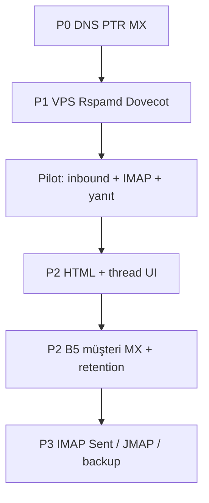

# E-posta platformu — kalan işler planı (2026-09)

Bu belge, **kodda tamamlanan** ile **henüz yapılmayan (ops / ürün)** işleri öncelik sırasına koyar.  
Branch: `cursor/own-mail-platform-519e`. VPS: `168.231.109.27`.

---

## Tamamlanan (özet)

| Faz | Kapsam | Durum |
|-----|--------|--------|
| **A** (kod) | Outbox, checklist A1–A7, bounce→suppression, drain, admin operasyon | ✅ |
| **B** | `kullanici.lerta.tr`, self-service kimlik, B3 rate, B4 suppression, **B5** özel domain, **B6** audit | ✅ |
| **C1** | Inbound webhook, Postfix pipe | ✅ (kod) |
| **C2** | Org webmail liste/okundu, virtual alias senkron, MX script | ✅ (kod) |
| **C3** | Compose/yanıt, ekler, spam kuralları | ✅ |
| **C4** | MIME/HTML, IMAP API+Maildir, Rspamd hook + scriptler | ✅ (kod; **VPS kurulum ertelendi**) |

---

## Öncelik 0 — Üretim itibarı (manuel DNS / Hostinger)

Bunlar kod değil; gelen kutusu ve bildirimlerin **Junk’e düşmesini** doğrudan etkiler.

| # | İş | Sorumlu | Doğrulama |
|---|-----|---------|-----------|
| P0-1 | `mail.lerta.tr` **A** → `168.231.109.27` (isimtescil yayılımı) | DNS | `dig +short mail.lerta.tr A` |
| P0-2 | **PTR** → `mail.lerta.tr` (Hostinger panel) | VPS sağlayıcı | `dig -x 168.231.109.27` |
| P0-3 | Faz A checklist **10/10** | Operasyon | Admin → Platform gönderim; [EMAIL_FAZ_A_DNS_PTR_CHECKLIST.md](./EMAIL_FAZ_A_DNS_PTR_CHECKLIST.md) |
| P0-4 | `kullanici.lerta.tr` SPF/DKIM verified + pilot From testi | DNS + admin | Kurumsal kimlik (B) |
| P0-5 | Pilot **MX** `kullanici.lerta.tr` → `mail.lerta.tr` | DNS | Dışarıdan test maili |

**Başarı:** `a.kutluhan@msn.com` (veya Gmail) inbox veya “önemsiz” — Junk oranı düşer.

---

## Öncelik 1 — VPS aktivasyonu (siz “sonra çalıştıracağız” dediğiniz paket)

Tek seferlik root scriptler; API deploy’dan **sonra** veya önce sırayla.

| Sıra | Script / aksiyon | Bağımlılık | Not |
|------|------------------|------------|-----|
| 1.1 | `setup-postfix-inbound-c2.sh` (zaten kısmen) | Postfix Faz A | `inet_interfaces`, virtual domain |
| 1.2 | Admin → **Postfix virtual senkron** | Provision edilmiş sender’lar | `MAIL_INBOUND_APPLY_POSTFIX=true` |
| 1.3 | `setup-rspamd-c4.sh` | Postfix | Milter 11332 |
| 1.4 | `setup-dovecot-c4.sh` | `MAIL_IMAP_MAILDIR_ROOT` | IMAP 993 |
| 1.5 | Org → **IMAP şifresi rotate** + Admin → **Dovecot passwd senkron** | 1.4 | Thunderbird pilot |
| 1.6 | `opendkim-tools` + özel domain testi | B5 müşteri DNS | `MAIL_SYNC_OPENDKIM=true` |

**.env kontrol listesi (VPS):**  
`MAIL_INBOUND_WEBHOOK_SECRET`, `MAIL_SYNC_OPENDKIM`, `MAIL_INBOUND_APPLY_POSTFIX`, `MAIL_IMAP_MAILDIR_ROOT`, `MAIL_IMAP_APPLY_DOVECOT`, `MAIL_RSPAMD_REJECT_SCORE`.

---

## Öncelik 2 — Ürün / kod (Faz C tamamlama + B operasyon)

| # | İş | Değer | Tahmini kapsam |
|---|-----|--------|----------------|
| P2-1 | **Giden HTML** compose (şu an düz metin + basit `<pre>`) | Profesyonel yanıt | `MailMailboxComposeService` + UI editor |
| P2-2 | **Konuşma thread** UI (`In-Reply-To`, References listesi) | Okunabilirlik | `mail_inbound` + `mail_mailbox_sent` birleşik görünüm |
| P2-3 | **Gönderim audit (KVKK)** — mailbox send log admin’de | Uyum | `MAIL_IDENTITY_*` benzeri `MAILBOX_SENT_*` veya outbox ayrımı net log |
| P2-4 | **Retention / kota** — `quotaBytes`, eski MIME silme job | Maliyet | Cron + admin politika |
| P2-5 | **Özel domain inbound** — MX müşteri.com + routing | B5 müşteri | `MAIL_INBOUND_VIRTUAL_DOMAINS` çoklu domain |
| P2-6 | **Rspamd öğrenme / greylist** UI yok, sadece skor | İtibar | Bayes eğitimi runbook |
| P2-7 | **Çalışan rolü** — inbox okuma tüm firmaya, gönderim owner (mevcut); net RBAC doc | Güvenlik | Küçük API guard + doc |
| P2-8 | **EMAIL_ROADMAP_EXECUTION.md** güncelle | Ekip | C1–C4 artık stub değil |

---

## Öncelik 3 — Strateji belgesindeki “sonra” maddeler

[EMAIL_PLATFORM_STRATEGY_ABC.md](./EMAIL_PLATFORM_STRATEGY_ABC.md) ve B dokümanları:

| Madde | Açıklama |
|--------|-----------|
| Gönderim audit / KVKK log (geniş) | B6 kimlik; **giden mailbox** ve **outbox** birleşik rapor henüz yok |
| Tam **IMAP yazma** (Sent klasörü Maildir `cur`) | Şu an inbound Maildir; gönderilenler DB’de |
| **JMAP** gateway | C7 — uzun vadeli |
| **eDiscovery / yedekleme** | C8 |
| **Faz C Reply-To → gerçek kutu** | Reply-To hâlâ platform hattı (B4); müşteri beklentisi netleştirilmeli |
| **Harici Gmail/ESP yok** ilkesi | Korunuyor; dokümante |

---

## Öncelik 4 — Repo / süreç

| # | İş |
|---|-----|
| P4-1 | GitHub **collaborator** → PR açılabilir (şu an compare URL) |
| P4-2 | `main` merge + tag “mail-platform-v1” (siz onayı) |
| P4-3 | İsteğe bağlı: CI’da `npm run build:all` + smoke `health` |

---

## Önerilen yürütme sırası (sprint mantığı)

1. **Hafta operasyon (siz):** P0-1…P0-5 + test adresine inbox doğrulama.  
2. **VPS günü (biz, siz onay):** P1-1…P1-6 tek oturum, checklist ile.  
3. **Ürün sprint:** P2-1, P2-2, P2-8 (kullanıcıya görünür iyileştirme).  
4. **Müşteri pilot:** P2-5 + B5 gerçek `@musteri.com`.  
5. **Uyum sprint:** P2-3, P2-4.

---

## “Bitti” tanımı (platform mail v1)

- [ ] Faz A checklist yeşil + PTR doğru  
- [ ] En az 1 org: `slug@kullanici.lerta.tr` ihale maili **inbox**  
- [ ] Aynı org: dış mail → panel gelen + (opsiyonel) IMAP okuma  
- [ ] Yanıt dışarı gider, `mail_mailbox_sent` dolu  
- [ ] Rspamd aktif, spam sekmesi doluyor (test)  
- [ ] B6 audit + runbook yazılı  

---

## İlgili dokümanlar

| Konu | Dosya |
|------|--------|
| Faz A | [EMAIL_FAZ_A_PRODUCTION.md](./EMAIL_FAZ_A_PRODUCTION.md), [EMAIL_FAZ_A_DNS_PTR_CHECKLIST.md](./EMAIL_FAZ_A_DNS_PTR_CHECKLIST.md) |
| Faz B | [EMAIL_FAZ_B_KULLANICI_LERTA_TR.md](./EMAIL_FAZ_B_KULLANICI_LERTA_TR.md), B5/B6 md |
| Faz C | C1–C4 md dosyaları |
| DNS isimtescil | [EMAIL_PHASE_A_DNS_ISIMTESCIL.md](./EMAIL_PHASE_A_DNS_ISIMTESCIL.md) |
