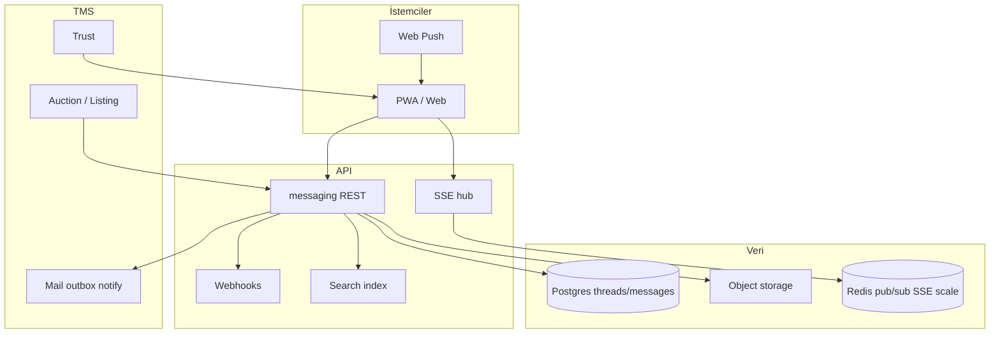
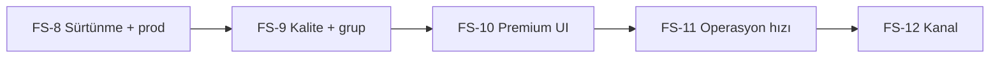

# Firma sohbeti — rakip analizi, hizmet envanteri ve üst seviye yol haritası

**Tarih:** 2026-09-28  
**Kapsam:** Lerta Logistics **firma sohbeti** (B2B şirket-şirket mesajlaşma, ihale/ilan bağlamı) — `app.lerta.com.tr/messaging` · `apps/api` `/messaging/*`  
**İlişkili:** [MESSAGING_PHASE_ROADMAP.md](./MESSAGING_PHASE_ROADMAP.md) (P0–P4 tamamlandı) · [MAIL_ADMIN_BENCHMARK_REPORT.md](./MAIL_ADMIN_BENCHMARK_REPORT.md) §3.3 · [LERTA_MAIL_MESSAGING_PARITY_100_ROADMAP.md](./LERTA_MAIL_MESSAGING_PARITY_100_ROADMAP.md) (#21, #34)

---

## 1. Executive özet

| Soru | Cevap |
|------|--------|
| Bugün neyiz? | **Lojistik TMS’e gömülü B2B müzakere sohbeti** — firma çifti + opsiyonel `freightListingId`, e-posta/kurumsal posta ile **aynı Mesajlar hub’ında**. |
| Rakip referans (genel ekip sohbeti) | **Slack ~95/100** — Lerta ağırlıklı **~84/100 (~%88 parite)**. |
| Rakip referans (nakliye operasyon) | **Super Dispatch / Emerge** — bildirim kataloğu ve kanal tercihlerinde Lerta **eş/üstün**; **canlı sohbet derinliği** onlarda zayıf, bizde **orta-iyi**. |
| WhatsApp Business? | **Ürün entegrasyonu yok**; sadece org profilinde WhatsApp numarası. Okundu/teslim beklentisi WA seviyesinde **karşılanmıyor (~%42)**. |
| Stratejik hedef | **Slack klonu değil** — **“Türkiye lojistik B2B işlem sohbeti”** kategorisinde **#1** (ihale, teklif, ek, güven skoru, KVKK, e-posta ile tek çatı). |
| 18 ay hedef skor | **~92/100** vs Slack (günlük kullanım) · **~95/100** vs TMS rakipleri (operasyon entegrasyonu). |

---

## 2. Bugünkü ürün (baseline envanter)

### 2.1 Verilen hizmetler (kod + prod)

| Alan | Özellik | Not |
|------|---------|-----|
| **Thread modeli** | İki şirket arası thread; listing ile scope | Tek kanal/grup yok |
| **Giriş noktaları** | İhale, pazar, ortaklar, ilanlar, `/messaging` | Deep link `companyId`, `listingId`, `threadId` |
| **Canlılık** | SSE (`/messaging/stream`) + 12 sn polling yedek | WebSocket yok; multi-instance SSE hub sınırlı |
| **Bildirim** | E-posta + operasyon olayı; web push (ayrı VAPID) | Push şirket bazlı abonelik |
| **Okundu** | Şirket seviyesi `lastReadAt` → “Okundu” etiketi | Kullanıcı bazlı ✓✓ değil |
| **Ekler** | 5 dosya, PDF/görsel/metin (sunucu ~10 MB) | XLSX UI’da yok |
| **Çeviri** | DeepL / LibreTranslate API | Mesaj bazlı TR↔EN (UI) |
| **Özet** | Kural tabanlı sidebar (`/summary`) | LLM değil |
| **Güven** | Karşı taraf trust skoru + `/trust` linki | TMS farkı |
| **Uyum** | Şirket sahibi JSON export; platform admin eDiscovery | ZIP/legal hold sohbet için zayıf |
| **Entegrasyon** | Fiyat teklifi → thread + formatlı mesaj | Auction API |
| **Hub UX** | Sohbet + kurumsal e-posta embed (posta) | Varsayılan sekme e-posta |

### 2.2 Verilmeyen / zayıf hizmetler

| Beklenti (Slack / Teams / WA Business) | Durum |
|----------------------------------------|--------|
| Kanal, grup, @mention, reaksiyon | Yok |
| Zengin metin, kod blok, snippet | Düz metin |
| Global mesaj arama (sunucu) | Sadece liste filtresi |
| Yazıyor / çevrimiçi | Yok |
| Mesaj düzenle/sil, sabitle, anket | Yok |
| Bot / webhook / slash command | Yok |
| Harici Graph API | İç REST |
| Native mobil uygulama | PWA |
| Okundu/teslim çift tik (kullanıcı) | ~%42 yol haritası |
| Moderasyon, DLP, retention politikası | Sadece export |
| Slack Connect / harici workspace | Yok |

---

## 3. Rakip grupları ve derinlemesine kıyas

### 3.1 Genel ekip iletişimi (referans: tam özellik seti)

| Platform | Asıl değer | Lojistik B2B için uygunluk | Lerta’ya göre |
|----------|------------|----------------------------|---------------|
| **Slack** | Kanal, arama, 2000+ entegrasyon, huddles | İhale bağlamı zayıf; ayrı ürün | Canlılık/arama/mention **geride**; TMS bağlantı **önde** |
| **Microsoft Teams** | M365, toplantı, dosya | Kurumsal TR’de yaygın | Teams’i **değiştirmeyiz**; **ihale thread’i** satarız |
| **Google Chat** | Workspace gömülü | Benzer Teams | Aynı |
| **Discord** | Topluluk, ses | B2B lojistik için uyumsuz | Kapsam dışı |

**Slack boyut skoru (docs, 0–100):**

| Boyut | Ağırlık | Lerta | Slack | Parite |
|-------|---------|-------|-------|--------|
| Canlılık (SSE/push) | 25% | 85 | 98 | 87% |
| UX (deep link, badge) | 25% | 84 | 92 | 91% |
| Ekler ve arama | 20% | 80 | 90 | 89% |
| TMS entegrasyon | 20% | 88 | 70 | 126% |
| Kurumsal (export, KVKK) | 10% | 78 | 85 | 92% |

### 3.2 Nakliye / TMS ve yük pazarı (doğrudan rakip)

| Platform | Sohbet / mesajlaşma | Bildirim | E-posta kutusu | Lerta fırsatı |
|----------|---------------------|----------|----------------|---------------|
| **Super Dispatch** | In-app + e-posta/SMS; rol tercihleri güçlü | ✓ | Harici | **Tek Mesajlar** (sohbet+mail); ihale deep link |
| **Emerge** | Portal mesajları; ağ odaklı | ✓ | Harici | **Trust + ihale bağlamı** sidebar |
| **Truckstop / DAT** | Load board mesajları (ABD) | Kısmi | — | TR pazarında benzer **ilan-thread** modeli |
| **Trans.eu / TimoCom** | Avrupa yük borsası chat | ✓ | — | Çok dilli çeviri (FS-3) |
| **Navlungo / benzeri TR** | WhatsApp ağırlıklı | WA | — | **KVKK + kayıtlı sohbet** argümanı |

**TMS’te satılabilir hizmetler (rakiplerde eksik veya zayıf):**

1. **İşlem bağlamlı sohbet** — her thread’de ilan no, rota, fiyat geçmişi, teklif mesajı otomatik.  
2. **Kurumsal e-posta + sohbet** — aynı tenant, aynı güven kimliği.  
3. **KVKK export + platform eDiscovery** — B2B uyuşmazlık kanıtı.  
4. **Çok dilli müzakere** — sınır ötesi taşımacılık (DE/RU/EN).  
5. **Güven skoru** — mesajlaşmadan önce karşı taraf itibarı.  
6. **Webhook ile ERP/TMS** — teklif kabulü → sizin API (F5).

### 3.3 WhatsApp Business / Telegram (informal kanal)

| Hizmet | WA Business API | Lerta firma sohbeti |
|--------|-----------------|---------------------|
| Okundu / teslim | ✓ kullanıcı düzeyi | Şirket read cursor |
| Medya, ses, konum | ✓ | Ek + metin; konum yok |
| Şablon mesaj (HSM) | ✓ pazarlama | Operasyon e-posta ayrı |
| Kayıt / eDiscovery | Zor, dağınık | Merkezi DB + export |
| KVKK veri sorumlusu | Müşteri + Meta | **Lerta tenant verisi** |
| İhale bağlamı | Manuel | **Native** |

**Ürün kararı:** WA’yı **birincil kanal yapmayın**; **“resmi müzakere kanalı”** olarak firma sohbetini konumlandırın. İsteğe bağlı **FS-7**: WA numarasına tıkla (mevcut profil) + gelecekte **sadece bildirim köprüsü** (Meta API maliyetli).

### 3.4 Operasyon bildirim SaaS (SendGrid vb.)

Firma sohbeti **in-app conversation**; SendGrid/Postmark **push-to-email**. Lerta **her ikisini** birleştirir (PM-8 matris). Rakipte sohbet yok — **hibrit avantaj**.

---

## 4. Sunabileceğimiz hizmet kataloğu (derinlemesine)

### 4.1 Çekirdek (mevcut + cilalama)

| Hizmet kodu | Müşteriye anlatım | Teknik |
|-------------|-------------------|--------|
| **FS-CORE-01** | İhale/ilandan tek tık sohbet | Deep link + `openThread` |
| **FS-CORE-02** | Karşı firmayla yazılı müzakere kaydı | `messages` + export |
| **FS-CORE-03** | Anlık mesaj (web + PWA) | SSE + push |
| **FS-CORE-04** | Teklif mesajı otomatik format | Auction → messenger |
| **FS-CORE-05** | Güven rozeti | Trust API |

### 4.2 Kurumsal / uyum (satış argümanı)

| Kod | Hizmet | Faz |
|-----|--------|-----|
| **FS-GOV-01** | Şirket sahibi tam thread export (JSON/CSV/ZIP) | FS-1 |
| **FS-GOV-02** | Legal hold — sohbet silme/dondurma | FS-4 |
| **FS-GOV-03** | Denetim izi (kim, ne zaman, hangi IP) | FS-4 |
| **FS-GOV-04** | Saklama süresi (90/365 gün) org politikası | FS-5 |
| **FS-GOV-05** | Platform eDiscovery ZIP + hash zinciri | FS-4 |

### 4.3 Operasyon verimliliği (TMS farkı)

| Kod | Hizmet | Faz |
|-----|--------|-----|
| **FS-OPS-01** | İlan özeti paneli (LLM + yapılandırılmış) | FS-2 |
| **FS-OPS-02** | Fiyat/teklif zaman çizelgesi | FS-2 |
| **FS-OPS-03** | Şablon cevaplar (“Araç uygun”, “Fiyat net değil”) | FS-2 |
| **FS-OPS-04** | XLSX/PDF ek + virüs tarama hook | FS-1 |
| **FS-OPS-05** | @mention (şirket içi kullanıcı) | FS-3 |
| **FS-OPS-06** | İç not (sadece kendi şirket görür) | FS-3 |

### 4.4 Entegrasyon ve API (gelir katmanı)

| Kod | Hizmet | Faz |
|-----|--------|-----|
| **FS-INT-01** | Outbound webhook: `message.created`, `thread.opened` | FS-5 |
| **FS-INT-02** | Public API read (thread list, messages) OAuth | FS-5 |
| **FS-INT-03** | Slack **gelen** bildirim (opsiyonel köprü) | FS-6 |
| **FS-INT-04** | Zapier/Make tetikleyici | FS-6 |
| **FS-INT-05** | ERP’ye teklif kabul event | FS-5 |

### 4.5 Deneyim (Slack paritesi)

| Kod | Hizmet | Faz |
|-----|--------|-----|
| **FS-UX-01** | Sunucu tarafı tam metin arama | FS-2 |
| **FS-UX-02** | Kullanıcı bazlı okundu (✓✓) | FS-3 |
| **FS-UX-03** | Yazıyor göstergesi | FS-3 |
| **FS-UX-04** | Markdown / hafif rich text | FS-2 |
| **FS-UX-05** | Mesaj düzenle (5 dk) / sil (soft) | FS-3 |
| **FS-UX-06** | SSE-only polling kaldır; reconnect UX | FS-1 |
| **FS-UX-07** | Mobilde tam ekran sohbet, varsayılan sekme politikası | FS-1 |

---

## 5. Hedef mimari (özet)



**Ölçek notu:** Bugün SSE hub **process içi**. FS-4’te **Redis pub/sub** veya eşdeğeri, FS-6’da **yatay API** için zorunlu.

---

## 6. Fazlı yol haritası (FS-1 … FS-7)

Önceki **P0–P4** tamamlandı. Yeni fazlar **üst seviye** hedefe göre sıralı; her faz **kod + verify script + doküman + kabul kriteri**.

### FS-1 — “Üretim güveni” (4–6 hafta teknik kapsam)

**Hedef:** Canlılık ve mobilde sürtünme kalkar; ekler lojistikte gerçekçi; dokümantasyon tutarlı.

| # | İş | Kabul |
|---|-----|--------|
| 1.1 | SSE başarılı bağlantıda **polling’i kapat**; exponential reconnect | p95 görünürlük &lt;3 sn (aynı thread, staging) |
| 1.2 | Ek: **XLSX**, boyut UI = sunucu (5×10 MB); hata metinleri düzelt | PM-7 ile uyum |
| 1.3 | `MessagingModuleStatus` → `attachments`, `web_push` feature bayrakları | `/messaging/status` |
| 1.4 | Mesajlar sekmesi: `?companyId` geldiğinde **varsayılan sohbet** (ürün kararı dokümante) | UX test |
| 1.5 | `scripts/verify-firma-sohbeti-fs1.sh` — SSE, ek upload smoke | CI opsiyonel |
| 1.6 | Admin export yolu doküman = kod (`message-threads/export`, JSON) | Doc fix |

**Skor hedefi:** Canlılık 85→**90**, Ekler 80→**86**.

---

### FS-2 — “Operasyon zekâsı” (6–8 hafta)

**Hedef:** TMS rakiplerinden ayrışma; arama ve içerik.

| # | İş | Kabul |
|---|-----|--------|
| 2.1 | **Sunucu arama** `GET /messaging/search?q=` (thread + body, org scope) | 10k mesaj/thread staging &lt;500 ms |
| 2.2 | **Markdown** render (link, kalın, liste); XSS sanitize | Güvenlik review |
| 2.3 | **Şablon mesajlar** (org + sistem, 10 adet) | Ayarlar veya compose dropdown |
| 2.4 | **LLM özet** thread sidebar (`MESSAGING_SUMMARY_LLM` flag) | KVKK: org opt-in |
| 2.5 | Teklif zaman çizelgesi (mesajlardan parse + auction events) | Sidebar widget |
| 2.6 | İlan kartı sabit üst bilgi (rota, tonaj, fiyat) | Listing API |

**Skor hedefi:** TMS entegrasyon 88→**95**, Ekler/arama 80→**88**.

---

### FS-3 — “Kurumsal sohbet kalitesi” (8–10 hafta)

**Hedef:** Slack’in günlük kullanımında eksik kalan “sosyal” katman (mention, okundu, yazıyor).

| # | İş | Kabul |
|---|-----|--------|
| 3.1 | **Kullanıcı read receipt** (`message_read_by_user`) | ✓✓ karşı taraf kullanıcı listesi (GDPR: sadece iş hesabı) |
| 3.2 | **Typing** SSE event `typing` (3 sn TTL) | İki taraf görür |
| 3.3 | **@mention** şirket içi kullanıcı; bildirim push+email | `USER_MENTION` olay kodu |
| 3.4 | **İç not** mesaj tipi `internal` (karşı taraf görmez) | RBAC |
| 3.5 | Mesaj **düzenle/sil** (soft delete, audit) | eDiscovery’de görünür |
| 3.6 | **Çeviri** UI: DE/RU + otomatik karşı dil önerisi | DeepL prod |

**Skor hedefi:** Okundu/teslim **42→75**; genel Slack parite **88→93%**.

---

### FS-4 — “Uyum ve ölçek” (10–12 hafta)

**Hedef:** Enterprise satış; çok instance SSE.

| # | İş | Kabul |
|---|-----|--------|
| 4.1 | **Redis** (veya eşdeğeri) SSE fan-out | 2 API instance smoke |
| 4.2 | **Legal hold** thread/mesaj (mail ile aynı model) | Export’ta işaret |
| 4.3 | **Audit log** mesaj CRUD (IP, user agent) | DPO örnek rapor |
| 4.4 | eDiscovery **ZIP** + manifest SHA-256 | Platform admin |
| 4.5 | Bağlantı limiti + **p95** load script genişletme | `smoke-messaging-sse-load.sh` |
| 4.6 | Rate limit: mesaj/dk şirket bazlı | Abuse önleme |

**Skor hedefi:** Kurumsal 78→**90**; SSE ölçek yol haritası #7 ile hizalı.

---

### FS-5 — “Platform ve otomasyon” (8 hafta)

**Hedef:** Entegrasyon geliri; müşteri kendi sistemine bağlar.

| # | İş | Kabul |
|---|-----|--------|
| 5.1 | Webhook abonelikleri org bazlı (HMAC imza) | `message.created` |
| 5.2 | **Public API** OAuth scope `messaging:read` | F5 ile uyum |
| 5.3 | **Retention policy** job (arşiv/sil) | Org ayarı |
| 5.4 | Teklif **kabul** mesaj aksiyonu → auction state | Tek tık |
| 5.5 | Bildirim matrisinde **sohbet push** ayrı satır (TMS %100) | Profil UI |

**Skor hedefi:** Public API 68→**82** (Graph-class hâlâ dışı).

---

### FS-6 — “Ekosistem” (isteğe bağlı, 12+ hafta)

| # | İş | Not |
|---|-----|-----|
| 6.1 | Slack incoming webhook (bildirim köprüsü) | #147 ile örtüşebilir |
| 6.2 | Zapier / Make resmi connector | FS-5 webhook üstüne |
| 6.3 | **Bot kullanıcı** + API token (sadece okuma/yazma thread) | Lojistik otomasyon |
| 6.4 | WebSocket gateway (SSE yanında) | Sadece gerekirse (#20) |

---

### FS-7 — “Kanal genişleme” (ürün kararı)

| Seçenek | Açıklama | Risk |
|---------|----------|------|
| **A — Grup thread** | 3+ firma (ör. nakliyeci + yükleyici + acente) | Veri modeli değişir |
| **B — WA bildirim köprüsü** | Sadece “yeni mesaj” SMS/WA | Meta maliyet, KVKK |
| **C — Native app** | Capacitor shell | #22 düşük öncelik |

**Öneri:** FS-7A’yı **sadece acente senaryosu** netleşince açın; önce FS-1…5.

---

## 7. Ölçüm ve kabul (sürekli)

| Metrik | Kaynak | FS-1 hedef | FS-3 hedef |
|--------|--------|------------|------------|
| Slack ağırlıklı skor | Bu doküman §3.1 | 86 | 90 |
| Okundu/teslim madde #34 | Parity tablosu | 55 | 75 |
| p95 mesaj görünürlük | SSE load script | &lt;3 sn | &lt;2 sn |
| Push teslim (Android PWA) | `verify-messaging-web-push-prod.sh` | %95 başarı staging | prod |
| iOS PWA push | Manuel | dokümante | kanıt |
| NPS (pilot 5 firma) | Ürün | baseline | +10 |

**Doğrulama paketi (güncellenecek):**

```bash
bash scripts/run-mail-messaging-parity-close-checklist.sh
bash scripts/smoke-messaging-sse-load.sh
bash scripts/verify-messaging-web-push-prod.sh /var/www/nakliyeborsasi/.env
# FS-1 sonrası:
# bash scripts/verify-firma-sohbeti-fs1.sh
```

---

## 8. Bilinçli yapılmayacaklar

| Özellik | Neden |
|---------|--------|
| Tam Slack clone (huddles, clips, canvas) | ROI düşük; TMS odak |
| Tüketici WhatsApp sohbetini değiştirme | Meta politikası + dağınık kayıt |
| Sınırsız kamu kanalları | Moderasyon maliyeti |
| E2E şifreleme (Signal modeli) | eDiscovery / B2B uyuşmazlık ihtiyacı |
| Graph API seviyesi evrensel API | F5 read/write yeterli |

---

## 9. Satış / pazarlama mesajı (özet)

> **Lerta Firma Sohbeti**, ihale ve yük ilanınızın yanında, karşı firmayla **kayıtlı, KVKK uyumlu, çok dilli** müzakere kanalıdır. E-posta kutunuz ve operasyon bildirimlerinizle **aynı panelde**; güven skoru ve teklif geçmişi **otomatik bağlamlıdır**. Slack kadar “sohbet oyunu” değil; **nakliyede anlaşmayı hızlandıran resmi kanal**.

---

## 10. Sonraki adım

1. **FS-1…FS-7** kod tamam — odak **prod kapanışı** + **FS-8…FS-12 (Excellence)**.  
2. Her faz sonunda: parity **#21**, **#34**, **#7** güncelle · `verify-firma-sohbeti-fs*.sh` + VPS checklist.  
3. Ürün hedefi: **TMS sohbetinde TR/EU #1** · Slack günlük UX **~%92** · WA bildirim beklentisi **~%70** (kayıt Lerta’da).

---

## 11. Excellence yol haritası (FS-8 … FS-12)

**Başlangıç (2026-09):** Kod FS-1…7 ✅ · Prod ortalama **~%72** · Firma sohbeti UX son cilalar (compose dock) prod’a alındı.  
**18 ay üst hedef:** TMS referans **~%98** · Slack ağırlıklı **~%92** · WA tüketici UX **~%65** (bilinçli: E2E/kanal klonu değil).

### Hedef skor tablosu (faz sonları)

| Faz | Süre (teknik kapsam) | vs TMS (işlem sohbeti) | vs Slack (UX) | vs WA (mobil/okundu) | Prod parity (sohbet odak) |
|-----|----------------------|-------------------------|---------------|----------------------|---------------------------|
| **FS-8** | 4–6 hf | 92→**96** | 86→**88** | 55→**58** | 72→**82** |
| **FS-9** | 6–8 hf | 96→**98** | 88→**90** | 58→**65** | 82→**86** |
| **FS-10** | 6–8 hf | 98→**99** | 90→**91** | 65→**68** | 86→**89** |
| **FS-11** | 4–6 hf | 99→**99** | 91→**92** | 68→**70** | 89→**91** |
| **FS-12** | 8–12 hf (ürün kararı) | **99+** | 92→**93** | 70→**72** | 91→**93** |

---

### FS-8 — “Günlük kullanım sürtünmesi sıfır” (P0)

**Amaç:** Kullanıcı UUID görmez; prod canlılık kurumsal satışa hazır.

| # | İş | Kabul kriteri |
|---|-----|----------------|
| 8.1 | **Firma arama API** — `GET /messaging/companies/search?q=` (legal name, unvan, opsiyonel vergi no; org scope + güven filtresi) | 3+ karakter, &lt;300 ms staging |
| 8.2 | **Birleşik arama UI** — UUID yedek; “Yeni sohbet” panelinde firma kartı (unvan, güven, son işlem) | UX test 5 pilot firma |
| 8.3 | **Prod SSE ölçek** — `REDIS_URL` + `MESSAGING_SSE_REDIS_FANOUT=1` zorunlu checklist | 2 API instance smoke PASS |
| 8.4 | **Push prod kapanış** — sohbet VAPID, fallback kapalı doğrulama | `verify-messaging-web-push-prod.sh` PASS |
| 8.5 | **Hub politikası** — `?tab=sohbet` veya org ayarı “varsayılan firma sohbeti” | Ayarlar + doküman |
| 8.6 | `scripts/verify-firma-sohbeti-fs8.sh` | CI opsiyonel |

**Parity:** #7 SSE · #8 push · compose/search UX.

---

### FS-9 — “Kurumsal sohbet kalitesi” (P0–P1)

**Amaç:** TMS + Slack günlük kullanımda eksik kalan “güven ve işbirliği” katmanı.

| # | İş | Kabul kriteri |
|---|-----|----------------|
| 9.1 | **Okundu paneli** — mesajda ✓ / ✓✓; “Kim okudu” (karşı şirket iş hesapları, GDPR metni) | Parity **#34** → **%75+** |
| 9.2 | **Grup thread UI** — 3+ firma; mevcut `openGroupThread` API’ye compose + liste | Acente senaryosu demo |
| 9.3 | **Düzenle / sil UX** — modal, süre limiti gösterimi, audit görünür | `window.prompt` kaldırılır |
| 9.4 | **@mention bildirim** — push + e-posta özeti; mention highlight render | FS-3 tam kapanış |
| 9.5 | **İç not** — balon stili ayrı; listede filtre “sadece iç notlar” | Karşı taraf API negative test |
| 9.6 | `verify-firma-sohbeti-fs9.sh` | |

**Parity:** #21 Slack **~%90** · #34 **%75**.

---

### FS-10 — “Premium görünüm ve mobil” (P1–P2)

**Amaç:** Trans.eu / WA kullanıcısının “bu ucuz değil” demesi.

| # | İş | Kabul kriteri |
|---|-----|----------------|
| 10.1 | **Ekler** — sürükle-bırak, küçük resim/PDF önizleme, indirme progress | 5×10 MB regresyon |
| 10.2 | **Mesaj listesi** — gün ayırıcı, avatar/initials, alıntılı yanıt (quote) | Mobil 390px |
| 10.3 | **Arama 2.0** — thread içi highlight, sonuçta scroll-to-message | Sunucu arama FS-2 üstü |
| 10.4 | **Bağlam kartı** — sabit üst şerit: rota, tonaj, fiyat, güven (collapse) | İlan thread’de zorunlu |
| 10.5 | **Mobil sohbet** — `/messaging` tam ekran thread, geri jesti, compose dock sticky | Lighthouse mobil ≥75 |
| 10.6 | **Erişilebilirlik** — mention klavye, focus trap modal, `aria` audit | axe kritik 0 |

---

### FS-11 — “Operasyon hızı” (P2)

**Amaç:** Nakliyede karar verdirici mikro özellikler (Slack’in hafif yüzü).

| # | İş | Kabul kriteri |
|---|-----|----------------|
| 11.1 | **Hızlı reaksiyon** — Onaylandı / Reddedildi / Görüldü (işlem damgası, audit) | Teklif thread’inde 1 tık |
| 11.2 | **Şablon yönetimi** — şirket admin CRUD (TR/EN), compose’da kategoriler | 20 şablon/org |
| 11.3 | **Klavye** — `/` şablon, `@` mention, `Esc` panel | Power user test |
| 11.4 | **Bildirim matrisi** — sohbet mention / iç not / grup ayrı satır prod doğrulama | TMS **%100** |
| 11.5 | **eDiscovery prod** — legal hold + ZIP kanıt paketi (DPO örnek) | Parity **#27** prod **%85+** |
| 11.6 | `verify-firma-sohbeti-fs11.sh` | |

**Hedef:** TMS **~%99** · Slack UX **~%92**.

---

### FS-12 — “Kanal ve mağaza” (P3, ürün onayı)

**Amaç:** TR pazarında WA alışkanlığını **kayıt dışına kaçırmadan** tamamlamak.

| Seçenek | İş | Kabul | Risk |
|---------|-----|--------|------|
| **12A** | WA / SMS **sadece bildirim köprüsü** (“yeni mesaj” → deep link) | Meta/Twilio sandbox + KVKK metni | Maliyet |
| **12B** | **Capacitor** shell (FS-7C uygulama) — push FCM/APNs | Mağaza beta 1 koridor | Bakım |
| **12C** | **Partner API** `messaging:write` + webhook genişletme | 1 entegratör pilot | Güvenlik review |
| **12D** | Gelişmiş grup — rol (yükleyici/nakliyeci/acente) + davet | Veri modeli review | Kapsam |

**Bilinçli erteleme:** Tam Slack (huddle, canvas), tüketici WA sohbetinin yerine geçme, sınırsız kamu kanalları.

---

### Fazlar arası bağımlılık



---

### Her faz sonu ölçüm (zorunlu)

| Metrik | Araç |
|--------|------|
| Slack/TMS skor güncelleme | Bu doküman §3 + [MAIL_ADMIN_BENCHMARK_REPORT.md](./MAIL_ADMIN_BENCHMARK_REPORT.md) §3.3 |
| Prod parity | [LERTA_MAIL_MESSAGING_PARITY_100_ROADMAP.md](./LERTA_MAIL_MESSAGING_PARITY_100_ROADMAP.md) #21 #34 #7 #8 |
| Canlılık p95 | `smoke-messaging-sse-load.sh` |
| Push | `verify-messaging-web-push-prod.sh` |
| Pilot NPS | 5 firma, sohbet haftalık aktif kullanıcı |

---

### Öncelik sırası (ürün onayı için tek sayfa)

1. **FS-8** — firma adıyla sohbet + prod SSE/push (satış blokajı).  
2. **FS-9** — okundu + grup UI + düzenleme (kurumsal güven).  
3. **FS-10** — görünüm + mobil (WA algısına yaklaşma).  
4. **FS-11** — reaksiyon/şablon/eDiscovery prod (TMS #1).  
5. **FS-12** — WA bildirim / native (pazar opsiyonu).

---

*Skorlar [MAIL_ADMIN_BENCHMARK_REPORT.md](./MAIL_ADMIN_BENCHMARK_REPORT.md) ve kod envanterine dayanır; rakip özellikleri kamu dokümantasyonu ve sektör ürün sayfalarından derlenmiştir.*
