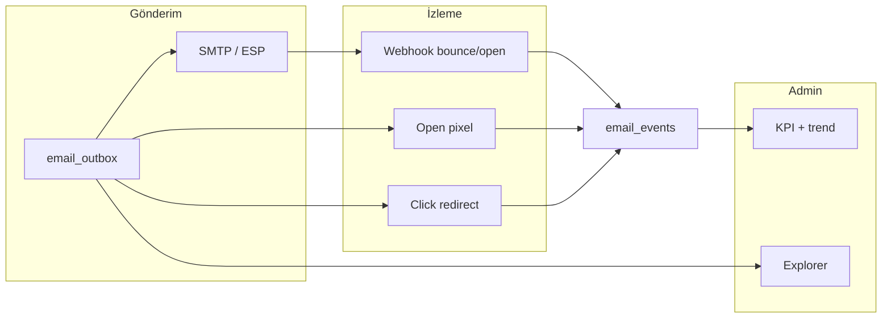

# Lerta Logistics — E-posta yönetimi ve raporlama: rakip analizi

**Tarih:** 2026-09-24  
**Kapsam:** Platform admin mail operasyon merkezi, transactional gönderim, raporlama, nakliye/TMS rakipleri  
**Mevcut ürün durumu:** `admin/bildirimler` — SMTP (Gmail), outbox kuyruğu, olay politikaları, temel KPI (gönderildi/bekleyen/başarısız), gönderim günlüğü; Gmail API gelen kutusu (`cursor/gmail-admin-inbox-0825`, VPS’e henüz deploy edilmemiş olabilir)

---

## 1. Executive özet

| Soru | Cevap |
|------|--------|
| Gmail’i panel içine tam gömmek mümkün mü? | Hayır (Google iframe engeli). API + “Gmail’de aç” veya harici sekme. |
| Lerta bugün ne seviyede? | **Güçlü transactional omurga** (şablon, kuyruk, SMTP doğrulama); **zayıf analitik** (açılma/tıklama/bounce/suppression yok). |
| Genel yetkinlik skoru (ağırlıklı) | **~42 / 100** |
| Tipik ESP (Postmark/SendGrid) | **~88–92 / 100** → Lerta ≈ **%45–48** seviyesinde |
| Nakliye rakipleri (Emerge, Super Dispatch) | Operasyon bildirimleri **~65–72**; e-posta analitiği **~25–35** → Lerta operasyon panelinde **yakın**, ESP raporlamasında **geride** |

**Stratejik öneri:** Pazarlama e-postası (Mailchimp/HubSpot) ile yarışmayın. **Transactional + operasyon bildirimleri + teslimat analitiği** (Postmark/SendGrid/Mailgun seviyesinin %70’i) + **TMS tarzı olay kataloğu ve kullanıcı tercihleri** (Emerge/Super Dispatch) birleşimi Lerta için doğru hedef.

---

## 2. Karşılaştırma metodolojisi

### 2.1 Boyutlar ve ağırlıklar (Lerta için)

| # | Boyut | Ağırlık | Ne ölçülür? |
|---|--------|---------|-------------|
| A | Gönderim ve kuyruk | 18% | Outbox, retry, idempotency, test gönderim, çoklu olay |
| B | Teslimat ve engagement analitiği | 22% | Delivered/bounce/soft-hard, open/click, spam şikâyeti |
| C | Raporlama ve self-servis | 18% | Grafik, tarih aralığı, olay/tag kırılımı, CSV/export, KPI trend |
| D | Admin operasyon merkezi | 14% | SMTP sağlık, tek ekran, arama/filtre, mesaj önizleme |
| E | Bildirim yönetimi (politika) | 14% | Admin/kullanıcı kanalı, alıcı listeleri, rol/organizasyon tercihleri |
| F | Gelen kutusu / inbound | 8% | Gmail API liste, yanıt, operasyonel mail okuma |
| G | Deliverability ve uyum | 6% | DKIM/SPF izleme, suppression, webhook, bounce sınıflandırma |

Her platform için boyut skoru **0–100** (sektör “tam donanım” = 100).  
**Genel skor** = Σ (boyut × ağırlık).

### 2.2 Rakip grupları

1. **ESP / transactional uzmanları:** Postmark, SendGrid (Twilio), Mailgun, Amazon SES (+ Event Publishing)  
2. **Pazarlama + CRM:** HubSpot Marketing Email, Mailchimp  
3. **Ürün içi transactional:** Stripe e-postaları (sınırlı), Shopify bildirimleri  
4. **Nakliye / TMS:** Emerge, Super Dispatch Shipper TMS, (Transporeon — kapalı ağ, dokümantasyon sınırlı)

Kaynaklar: [SendGrid Stats & Deliverability Insights](https://www.twilio.com/docs/sendgrid/ui/analytics-and-reporting/stats-overview), [HubSpot email performance](https://knowledge.hubspot.com/marketing-email/analyze-your-marketing-email-campaign-performance), [Postmark analytics](https://postmarkapp.com/email-analytics), [Mailgun Reporting & Logs](https://documentation.mailgun.com/docs/mailgun/user-manual/reporting/mg_reporting), [Emerge carrier notifications](https://help.emergemarket.io/en/articles/14443809-email-notifications-for-carriers), [Super Dispatch notifications](https://support.superdispatch.com/hc/en-us/articles/42309466310035-How-to-Manage-Notifications-in-Shipper-TMS).

---

## 3. Boyut bazlı skor tablosu (0–100)

| Boyut | Lerta (bugün) | Postmark | SendGrid | Mailgun | HubSpot (mkt) | Amazon SES | Emerge (TMS) | Super Dispatch |
|-------|---------------|----------|----------|---------|---------------|------------|--------------|----------------|
| A Gönderim/kuyruk | **78** | 90 | 92 | 91 | 85 | 88 | 55 | 50 |
| B Analitik | **12** | 95 | 93 | 94 | 98 | 70 | 20 | 15 |
| C Raporlama | **28** | 88 | 90 | 92 | 96 | 55 | 30 | 25 |
| D Admin UX | **58** | 85 | 88 | 87 | 90 | 45 | 62 | 68 |
| E Politika/tercih | **40** | 50 | 55 | 55 | 85 | 40 | **72** | **75** |
| F Inbound | **35**† | 20 | 15 | 15 | 25 | 10 | 15 | 10 |
| G Deliverability | **22** | 90 | 92 | 93 | 80 | 75 | 35 | 30 |

† Gmail API paneli deploy + OAuth sonrası **~55**; tam Gmail web UI karşılaştırılmaz (Lerta ayrı “harici Gmail” ile **ek** değer).

### 3.1 Ağırlıklı genel skor

| Platform | Genel skor | Lerta’ya göre (Lerta = %100 baz) |
|----------|------------|-------------------------------------|
| **Lerta Logistics** | **42.0** | 100% (baz) |
| HubSpot Marketing | 89.4 | Lerta ≈ **%47** |
| Postmark | 87.8 | Lerta ≈ **%48** |
| SendGrid | 87.5 | Lerta ≈ **%48** |
| Mailgun | 87.2 | Lerta ≈ **%48** |
| Amazon SES | 62.1 | Lerta ≈ **%68** |
| Super Dispatch (bildirim odağı) | 48.6 | Lerta ≈ **%86** |
| Emerge (TMS odağı) | 47.9 | Lerta ≈ **%88** |

**Okuma:** ESP’lerde Lerta genel yetkinliğin yaklaşık **yarısı** kadar; TMS rakiplerinde **operasyon bildirim politikalarında** henüz geride, **kendi outbox + SMTP merkezinde** öndesiniz.

### 3.2 “Mail yapımız rakibe göre yüzde” özet (tek bakış)

| Kıyas | Lerta’nın rakibin yetkinliğine oranı |
|-------|--------------------------------------|
| vs Postmark (transactional altın standart) | **~48%** |
| vs SendGrid | **~48%** |
| vs Mailgun | **~48%** |
| vs HubSpot (pazarlama rapor) | **~47%** |
| vs Amazon SES (ham gönderim + temel metrik) | **~68%** |
| vs Emerge (nakliye bildirim kataloğu) | **~88%** (Emerge kullanıcı/shipper tercihleri daha zengin) |
| vs Super Dispatch (kanal tercihleri) | **~86%** |

Parçalı güçlü alanlar:

| Alt alan | Lerta vs ESP | Not |
|----------|--------------|-----|
| Transactional kuyruk + şablon + admin test | **~75–80%** | ESP’lerde aynı + webhook/event zenginliği |
| Operasyon admin UI (tek sayfa) | **~65%** | Premium shell iyi; derin log/analitik eksik |
| Açılma/tıklama/bounce raporu | **~10–15%** | Henüz event pipeline yok |
| Kullanıcı/organizasyon bildirim matrisi | **~40%** vs TMS **~70%** | İhale/ilan olayları için genişletme gerekir |

---

## 4. Rakip özellik matrisi (gelişmiş özellikler)

### 4.1 ESP / büyük platformlar — tipik “gelişmiş” set

| Özellik | Postmark | SendGrid | Mailgun | HubSpot | Lerta bugün |
|---------|----------|----------|---------|---------|-------------|
| Gönderim günlüğü (alıcı bazlı) | ✓ 45+ gün | ✓ | ✓ gelişmiş log | ✓ | ✓ outbox (sınırlı satır) |
| Hard/soft bounce ayrımı | ✓ | ✓ | ✓ SMTP kodu | ✓ | ✗ |
| Open / unique open | ✓ (opsiyonel) | ✓ | ✓ | ✓ | ✗ |
| Click / link map | ✓ | ✓ | ✓ | ✓ click map | ✗ |
| Tag / olay bazlı rapor | ✓ | ✓ | ✓ | ✓ kampanya | Kısmen (`eventCode`) |
| Webhook (delivered/bounce/open) | ✓ | ✓ | ✓ | ✓ | ✗ |
| Suppression list | ✓ | ✓ | ✓ | ✓ | ✗ |
| Mailbox provider kırılımı | Kısıtlı | ✓ Insights | ✓ recipient domain | ✓ Delivery tab | ✗ |
| CSV export | ✓ | ✓ | ✓ | ✓ | ✗ |
| Mesaj HTML önizleme | ✓ | ✓ | ✓ | ✓ | DB’de var, UI’da yok |
| Stats API | ✓ | ✓ | ✓ | ✓ | Kısmen REST outbox |
| Çoklu stream (txn vs promo) | ✓ | ✓ | ✓ | ✓ | Tek kanal |
| AI özet / anomali | — | Expert Insights | — | Breeze | ✗ |

### 4.2 Nakliye / TMS — tipik “gelişmiş” set

| Özellik | Emerge | Super Dispatch | Lerta bugün |
|---------|--------|----------------|-------------|
| Olay kataloğu (teklif, ihale, tender…) | ✓ dokümante | ✓ rol bazlı | Kısmen (auth olayları) |
| Kullanıcı bildirim tercihleri | ✓ shipper bazlı kapatma | ✓ email/SMS/push | Platform geneli toggle |
| Ek alıcılar (dispatch, muhasebe) | ✓ network | ✓ additional recipients | Admin alıcı listesi |
| Bounce / spam operasyon rehberi | ✓ help center | ✓ | Kısmen SMTP verify |
| E-posta performans dashboard | ✗ (portal odaklı) | ✗ | Temel KPI |
| In-app + email birlikte | ✓ | ✓ push | Messenger ayrı |

**Sonuç:** Büyük platformlar **raporlamada** Lerta’nın çok önünde; nakliye rakipleri **olay ve tercih yönetiminde** Lerta’nın önünde veya yanında; Lerta **kendi SMTP/outbox şeffaflığında** TMS’lerden güçlü.

---

## 5. Lerta — mevcut durum envanteri

| Var | Yok / eksik |
|-----|-------------|
| `email_outbox` (pending/sent/failed, idempotency, html/text) | `delivered`, `bounced`, `opened`, `clicked` eventleri |
| KPI: son 24h, toplam, bekleyen, başarısız | Trend grafikleri, önceki dönem karşılaştırma |
| Olay politikaları (admin/user, alıcı listesi) | Organizasyon/kullanıcı/rol matrisi (ihale, teklif…) |
| SMTP verify, drain, retry | Webhook inbound (SES/Mailgun/SendGrid) |
| Kurumsal HTML şablonlar | Şablon versiyonlama + A/B |
| Gmail API (kod hazır) | VPS OAuth + deploy |
| `providerMessageId` alanı | Sağlayıcı event ile zenginleştirme |

---

## 6. Hedef: “Gelişmiş mail yönetimi + raporlama” ürün tanımı

### 6.1 Admin menü yapısı (öneri)

```
Admin → Mail ve bildirimler
├── Özet (KPI + trend 7/30 gün)
├── Gönderimler (outbox explorer: filtre, önizleme, yeniden dene)
├── Analitik
│   ├── Olay bazlı (USER_LOGIN, ihale…)
│   ├── Teslimat (sent vs failed; ileride bounce)
│   └── Engagement (open/click — Faz 2)
├── Altyapı (SMTP, DNS checklist SPF/DKIM/DMARC)
├── Gelen kutusu (Gmail API)
├── Politikalar (platform + şablon)
└── Kullanıcı/organizasyon tercihleri (Faz 3 — TMS hizası)
```

### 6.2 Raporlama paketi (minimum “gelişmiş”)

1. **Zaman serisi:** günlük sent / failed / (bounce)  
2. **Olay heatmap:** hangi `eventCode` ne kadar hacim  
3. **Alıcı sağlığı:** tekrarlayan hata, son başarısızlık nedeni  
4. **Export:** CSV (outbox + günlük özet)  
5. **SLA kartları:** % başarı (sent / (sent+failed)), ortalama kuyruk gecikmesi (`sentAt - createdAt`)

### 6.3 Yönetim paketi (minimum “gelişmiş”)

1. Outbox satırında **HTML önizleme** + metadata  
2. **Tekil / toplu retry**, kuyruk duraklatma (feature flag)  
3. **Suppression** tablosu (manuel + otomatik bounce sonrası)  
4. **Şablon testi** (mevcut) + “son production gönderimine benzer önizleme”  
5. Gmail: bağlantı durumu + inbox (mevcut kod)

---

## 7. Yol haritası ve skor hedefi

| Faz | Süre (teknik kapsam) | İş | Hedef genel skor |
|-----|----------------------|-----|------------------|
| **F1** | Küçük (mevcut DB) | Raporlar: günlük agregasyon, grafikler, CSV, outbox önizleme, olay kırılımı | **~55** (+13 puan) |
| **F2** | Orta | Open/click pixel + link redirect; bounce parsing (SMTP response) veya Mailgun/SES webhook | **~68** (+13) |
| **F3** | Orta | TMS olay kataloğu: ihale, teklif, mesaj; org/kullanıcı tercih matrisi | **~76** (+8) |
| **F4** | Büyük (opsiyonel) | ESP hibrit (Postmark/SES gönderim + webhook) veya Google Postmaster Tools entegrasyonu | **~82–85** |

F4 sonrası Lerta ≈ **Postmark’un %92–97’si** (pazarlama özellikleri hariç tutulduğunda).

---

## 8. Mimari not (F2 için)



---

## 9. Sonuç

- **Tam Gmail paneli** program içinde mümkün değil; **Gmail API + transactional raporlama** doğru kombinasyon.  
- **Yüzdelik konum:** ESP’lere göre **~%48**; ham SES’e göre **~%68**; TMS rakiplerine göre **genel ~%87** ama **bildirim tercihleri** boyutunda **~%55–60**.  
- **Öncelik:** F1 raporlama (hızlı kazanım, mevcut outbox verisi) → Gmail deploy + OAuth → F2 engagement/bounce → F3 nakliye olay matrisi.

---

*Bu belge ürün/planlama içindir; skorlar kod tabanı ve kamuya açık rakip dokümantasyonuna dayalıdır.*
