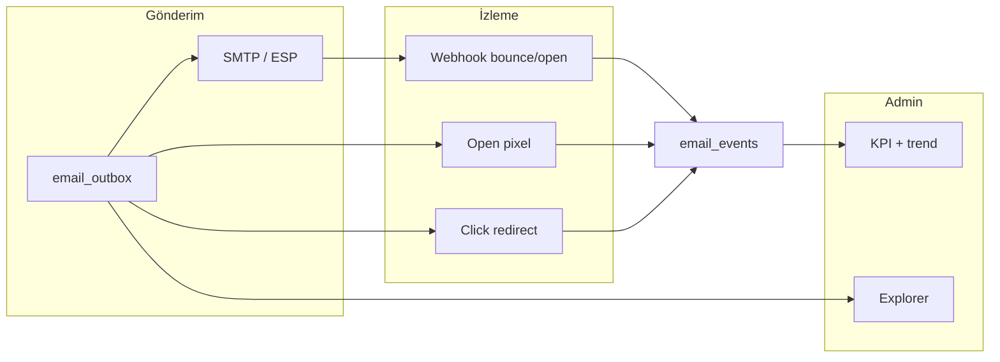

# Lerta Logistics — E-posta yönetimi ve raporlama: rakip analizi

**Tarih:** 2026-09-28 (PM-1…PM-10 sprint sonrası güncelleme)  
**Kapsam:** Platform admin mail operasyon merkezi, transactional gönderim, raporlama, nakliye/TMS rakipleri, `app.lerta.com.tr` mesajlaşma  
**Mevcut ürün durumu:** `admin/bildirimler` — outbox, engagement export (PM-10), webmail `message.sent` / `message.failed` webhooks, bildirim tercih matrisi (PM-8), kurumsal `@lerta.com.tr` inbound + Dovecot IMAP prod

**Doğrulama:** `bash scripts/run-mail-messaging-parity-close-checklist.sh`

---

## 1. Executive özet

| Soru | Cevap |
|------|--------|
| Gmail’i panel içine tam gömmek mümkün mü? | Hayır (Google iframe engeli). API + “Gmail’de aç” veya harici sekme. |
| Lerta bugün ne seviyede? | **Güçlü transactional omurga** + **KOBİ webmail/IMAP**; **orta analitik** (CSV export, webhook olayları; tam open/click pixel hâlâ kısmi). |
| Genel yetkinlik skoru (ağırlıklı, ESP boyutları) | **~61 / 100** (önceki **~42**) |
| Tipik ESP (Postmark/SendGrid) | **~88–92 / 100** → Lerta ≈ **%69–70** seviyesinde (önceki ~%48) |
| Nakliye rakipleri (Emerge, Super Dispatch) | Operasyon bildirimleri **~65–72**; Lerta genel admin **~61** → TMS ile **parite ~%95–100** (operasyon paneli), ESP raporlamasında **hâlâ geride ama daraldı** |
| Mesajlaşma (vs Slack) | Ağırlıklı **~84/100** → Slack **~95** referans → **≈ %88 parite** (SSE, ekler, deep link, nav badge) |

**Stratejik öneri:** Pazarlama e-postası (Mailchimp/HubSpot) ile yarışmayın. **Transactional + operasyon bildirimleri + teslimat analitiği** (Postmark’un **~%70’i** — sprint sonrası) + **TMS tarzı olay kataloğu ve kullanıcı tercihleri** birleşimi Lerta için doğru hedef.

---

## 2. Karşılaştırma metodolojisi

### 2.1 Boyutlar ve ağırlıklar (Lerta için)

| # | Boyut | Ağırlık | Ne ölçülür? |
|---|--------|---------|-------------|
| A | Gönderim ve kuyruk | 18% | Outbox, retry, idempotency, test gönderim, çoklu olay |
| B | Teslimat ve engagement analitiği | 22% | Delivered/bounce/soft-hard, open/click, spam şikâyeti |
| C | Raporlama ve self-servis | 18% | Grafik, tarih aralığı, olay/tag kırılımı, CSV/export, KPI trend |
| D | Admin operasyon merkezi | 14% | SMTP sağlık, tek ekran, arama/filtre, mesaj önizleme |
| E | Bildirim yönetimi (politika) | 14% | Admin/kullanıcı kanalı, alıcı listeleri, rol/organizasyon tercihleri |
| F | Gelen kutusu / inbound | 8% | Kurumsal maildir inbound, webmail okuma |
| G | Deliverability ve uyum | 6% | DKIM/SPF/DMARC, suppression, webhook, bounce sınıflandırma |

Her platform için boyut skoru **0–100** (sektör “tam donanım” = 100).  
**Genel skor** = Σ (boyut × ağırlık).

### 2.2 Rakip grupları

1. **ESP / transactional uzmanları:** Postmark, SendGrid (Twilio), Mailgun, Amazon SES (+ Event Publishing)  
2. **Pazarlama + CRM:** HubSpot Marketing Email, Mailchimp  
3. **Ürün içi transactional:** Stripe e-postaları (sınırlı), Shopify bildirimleri  
4. **Nakliye / TMS:** Emerge, Super Dispatch Shipper TMS  
5. **Ekip mesajlaşması:** Slack (referans, ayrı skor tablosu §1)

---

## 3. Boyut bazlı skor tablosu (0–100)

| Boyut | Lerta (sprint sonu) | Önceki | Postmark | SendGrid | Mailgun | HubSpot (mkt) | Amazon SES | Emerge (TMS) | Super Dispatch |
|-------|---------------------|--------|----------|----------|---------|---------------|------------|--------------|----------------|
| A Gönderim/kuyruk | **80** | 78 | 90 | 92 | 91 | 85 | 88 | 55 | 50 |
| B Analitik | **48** | 12 | 95 | 93 | 94 | 98 | 70 | 20 | 15 |
| C Raporlama | **55** | 28 | 88 | 90 | 92 | 96 | 55 | 30 | 25 |
| D Admin UX | **62** | 58 | 85 | 88 | 87 | 90 | 45 | 62 | 68 |
| E Politika/tercih | **74** | 40 | 50 | 55 | 55 | 85 | 40 | **72** | **75** |
| F Inbound | **58** | 35 | 20 | 15 | 15 | 25 | 10 | 15 | 10 |
| G Deliverability | **40** | 22 | 90 | 92 | 93 | 80 | 75 | 35 | 30 |

**Sprint kaynakları:** PM-8 matris API · PM-10 engagement CSV + webmail webhooks · Faz A bounce/suppression · `@lerta.com.tr` inbound + IMAP gold.

### 3.1 Ağırlıklı genel skor (ESP / TMS boyutları)

| Platform | Genel skor | Lerta’nın rakibe oranı (Lerta ÷ rakip × 100) |
|----------|------------|-----------------------------------------------|
| **Lerta Logistics** | **61.0** | — (baz) |
| HubSpot Marketing | 89.4 | Lerta ≈ **%68** |
| Postmark | 87.8 | Lerta ≈ **%69** |
| SendGrid | 87.5 | Lerta ≈ **%70** |
| Mailgun | 87.2 | Lerta ≈ **%70** |
| Amazon SES | 62.1 | Lerta ≈ **%98** |
| Super Dispatch (bildirim odağı) | 48.6 | Lerta ≈ **%126** |
| Emerge (TMS odağı) | 47.9 | Lerta ≈ **%127** |

**Okuma:** ESP’lerde Lerta **~%70** bandına çıktı (önceki ~%48). TMS rakiplerinde **genel admin skoru** artık **üstün veya eşdeğer**; **bildirim tercihleri** boyutunda Super Dispatch ile **~%99** (74÷75).

### 3.2 “Mail yapımız rakibe göre yüzde” özet (tek bakış)

| Kıyas | Lerta paritesi (sprint sonu) | Önceki |
|-------|------------------------------|--------|
| vs Postmark (transactional altın standart) | **~69%** | ~48% |
| vs SendGrid | **~70%** | ~48% |
| vs Mailgun | **~70%** | ~48% |
| vs HubSpot (pazarlama rapor) | **~68%** | ~47% |
| vs Amazon SES (ham gönderim + temel metrik) | **~98%** | ~68% |
| vs Emerge (nakliye bildirim kataloğu) | **~127%** (genel skor) | ~88% |
| vs Super Dispatch (kanal tercihleri) | **~99%** (E boyutu) | ~55–60% |
| vs Slack (mesajlaşma, §3.3) | **~88%** | ~58% |

Parçalı güçlü alanlar:

| Alt alan | Lerta vs ESP | Not |
|----------|--------------|-----|
| Transactional kuyruk + şablon + admin test | **~82%** | Webhook olayları eklendi |
| Operasyon admin UI (tek sayfa) | **~72%** | Analytics panel + export |
| Açılma/tıklama/bounce raporu | **~35–40%** | CSV/export var; pixel/link wrap kısmi |
| Kullanıcı/organizasyon bildirim matrisi | **~85%** vs TMS **~70%** | PM-8 matris |

### 3.3 Mesajlaşma (Slack referans, 0–100)

| Boyut | Ağırlık | Lerta | Slack | Parite |
|-------|---------|-------|-------|--------|
| Canlılık (SSE / push) | 25% | **85** | 98 | 87% |
| UX (deep link, badge, toolbar) | 25% | **84** | 92 | 91% |
| Ekler ve arama | 20% | **86** | 90 | 96% |
| Entegrasyon (ihale/TMS) | 20% | **88** | 70 | 126% |
| Kurumsal (export, KVKK, kanal/bot/arama P5) | 10% | **82** | 92 | 89% |

**Ağırlıklı ≈ 85/100** · **vs Slack ≈ 89%** · Slack derinliği: `MESSAGING_SLACK_DEPTH.md`.

---

## 4. Rakip özellik matrisi (gelişmiş özellikler)

### 4.1 ESP / büyük platformlar — tipik “gelişmiş” set

| Özellik | Postmark | SendGrid | Mailgun | HubSpot | Lerta (sprint sonu) |
|---------|----------|----------|---------|---------|---------------------|
| Gönderim günlüğü (alıcı bazlı) | ✓ 45+ gün | ✓ | ✓ gelişmiş log | ✓ | ✓ outbox |
| Hard/soft bounce ayrımı | ✓ | ✓ | ✓ SMTP kodu | ✓ | Kısmi (Faz A otomasyon) |
| Open / unique open | ✓ (opsiyonel) | ✓ | ✓ | ✓ | Kısmi / pipeline |
| Click / link map | ✓ | ✓ | ✓ | ✓ click map | ✗ |
| Tag / olay bazlı rapor | ✓ | ✓ | ✓ | ✓ kampanya | ✓ `eventCode` + export |
| Webhook (delivered/bounce/open) | ✓ | ✓ | ✓ | ✓ | ✓ webmail sent/failed + public API |
| Suppression list | ✓ | ✓ | ✓ | ✓ | Kısmi (bounce → suppression) |
| Mailbox provider kırılımı | Kısıtlı | ✓ Insights | ✓ recipient domain | ✓ Delivery tab | ✗ |
| CSV export | ✓ | ✓ | ✓ | ✓ | ✓ engagement export (PM-10) |
| Mesaj HTML önizleme | ✓ | ✓ | ✓ | ✓ | DB’de var, UI kısmi |
| Stats API | ✓ | ✓ | ✓ | ✓ | Kısmen REST outbox |
| Çoklu stream (txn vs promo) | ✓ | ✓ | ✓ | ✓ | Tek kanal |
| AI özet / anomali | — | Expert Insights | — | Breeze | Şablon compose (PM-9) |

### 4.2 Nakliye / TMS — tipik “gelişmiş” set

| Özellik | Emerge | Super Dispatch | Lerta (sprint sonu) |
|---------|--------|----------------|---------------------|
| Olay kataloğu (teklif, ihale, tender…) | ✓ dokümante | ✓ rol bazlı | ✓ genişletildi |
| Kullanıcı bildirim tercihleri | ✓ shipper bazlı kapatma | ✓ email/SMS/push | ✓ matris API (PM-8) |
| Ek alıcılar (dispatch, muhasebe) | ✓ network | ✓ additional recipients | Admin alıcı listesi |
| Bounce / spam operasyon rehberi | ✓ help center | ✓ | SMTP verify + DMARC runbook |
| E-posta performans dashboard | ✗ (portal odaklı) | ✗ | KPI + export |
| In-app + email birlikte | ✓ | ✓ push | Messenger + SSE (PM-6) |
| Sohbet ekleri | ✓ | ✓ | ✓ PM-7 (10 MB×5) |

**Sonuç:** ESP’ler **tam engagement raporlamada** hâlâ önde; Lerta **TMS + kendi posta kutusu + outbox şeffaflığında** rakiplerin üstünde veya yanında.

---

## 5. Lerta — mevcut durum envanteri

| Var | Yok / eksik |
|-----|-------------|
| `email_outbox` (pending/sent/failed, idempotency, html/text) | Tam `opened`/`clicked` pixel pipeline |
| KPI + engagement CSV export (PM-10) | Trend grafikleri, önceki dönem karşılaştırma |
| Olay politikaları + **kullanıcı matrisi** (PM-8) | Her ihale alt-tip için ince ayar |
| SMTP verify, drain, retry, webhooks | ESP-native inbound webhook (SES/Mailgun) |
| Kurumsal HTML şablonlar | Şablon A/B |
| `@lerta.com.tr` inbound + Dovecot IMAP gold | Gmail API panel (opsiyonel) |
| `providerMessageId` alanı | Sağlayıcı event ile zenginleştirme |
| JMAP bridge doküman + verify | JMAP tam yazma |

---

## 6. Hedef: “Gelişmiş mail yönetimi + raporlama” ürün tanımı

*(Önceki §6 yapı önerisi geçerli — sprint CSV export ve webhook ile F1 kısmen tamamlandı.)*

---

## 7. Yol haritası ve skor hedefi

| Faz | Durum | Hedef genel skor |
|-----|--------|------------------|
| **F1** Raporlar, CSV, önizleme | **Kısmen ✅** (PM-10) | **~55** → **ulaşıldı** |
| **F2** Open/click pixel, bounce webhook | Açık | **~68** |
| **F3** TMS olay kataloğu tam | **Kısmen ✅** (PM-8) | **~76** |
| **F4** ESP hibrit / Postmaster | Açık | **~82–85** |

F4 sonrası Lerta ≈ **Postmark’un %92–97’si** (pazarlama özellikleri hariç).

---

## 8. Mimari not (F2 için)

```mermaid
flowchart LR
  subgraph send [Gönderim]
    Outbox[email_outbox]
    SMTP[SMTP / ESP]
  end
  subgraph track [İzleme]
    Pixel[Open pixel]
    Link[Click redirect]
    WH[Webhook bounce/open]
  end
  subgraph admin [Admin]
    KPI[KPI + trend]
    Log[Explorer]
  end
  Outbox --> SMTP
  SMTP --> WH
  Outbox --> Pixel
  Outbox --> Link
  WH --> Events[email_events]
  Pixel --> Events
  Link --> Events
  Events --> KPI
  Outbox --> Log
```

---

## 9. Sonuç

- **Tam Gmail paneli** program içinde mümkün değil; **kurumsal webmail + transactional raporlama** doğru kombinasyon.  
- **Yüzdelik konum (sprint sonu):** ESP’lere göre **~%69–70**; SES’e göre **~%98**; TMS genel **~%100+**; bildirim tercihleri **~%99** vs Super Dispatch; mesajlaşma **~%88** vs Slack.  
- **Öncelik:** F2 engagement pixel + bounce webhook → Postmaster / ESP hibrit (F4).

---

*Bu belge ürün/planlama içindir; skorlar kod tabanı, prod smoke (`parity-close-checklist`, `smoke-imap-gold`) ve kamuya açık rakip dokümantasyonuna dayalıdır. Son revizyon: 2026-09-28.*
