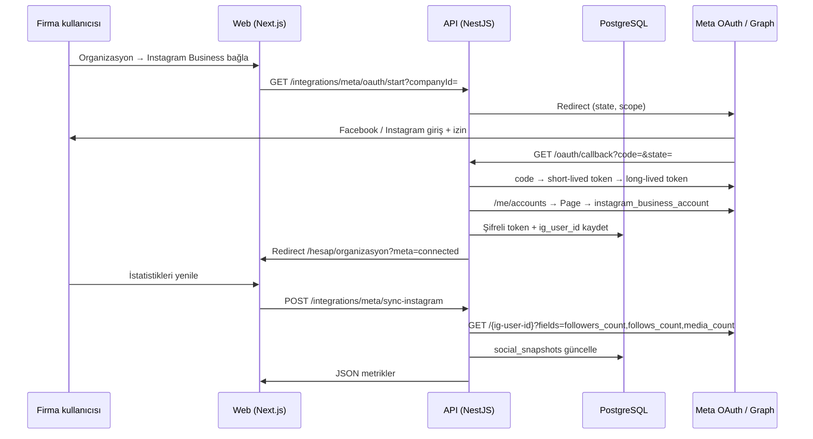

# Meta Graph (OAuth) — Tam Otomasyon Önergesi

**Ürün:** Nakliye Borsası  
**Konu:** Instagram / Facebook sosyal medya istatistiklerinin API ile otomatik çekilmesi  
**Durum:** Önerge (onay sonrası geliştirme)  
**İlişkili doküman:** [SOCIAL_MEDIA_CONNECTION.md](./SOCIAL_MEDIA_CONNECTION.md)

---

## 1. Özet

Bugün firma sosyal medya verileri üç kanaldan geliyor:

| Kanal | Ne işe yarar? | Sorun |
|--------|----------------|--------|
| Web sitesi taraması | URL, logo, sosyal linkler | Instagram sayıları yok |
| Sunucu anonim tarama | `web_profile_info` | VPS IP engeli, işletme hesabı hataları |
| Admin tarayıcı yardımcısı | Yer imi / yapıştır | Manuel, ölçeklenmez |

**Önerilen kalıcı çözüm:** Her firma (veya platform operatörü) **Meta OAuth** ile kendi Instagram Business / Facebook Sayfa hesabını bağlar. Nakliye Borsası API’si **Graph API** ile gönderi, takipçi, takip ve (izin varsa) temel içgörüleri periyodik çeker; sonuçlar **veritabanında** saklanır — artık yalnızca tarayıcı `localStorage`’a bağlı değil.

---

## 2. Hedefler ve kapsam

### 2.1 İş hedefleri

- Admin ve firma, **Organizasyon → Sosyal medya** ekranında güncel Instagram metriklerini görsün.
- **Tek tık** “Bağla / Yenile” ile sunucu tarafında güncelleme; yer imi veya kopyala-yapıştır zorunlu olmasın.
- VPS ve farklı tarayıcı/cihazlarda **aynı veri** görünsün (merkezi API + DB).

### 2.2 Teknik kapsam (MVP)

| Dahil | Hariç (sonraki faz) |
|--------|---------------------|
| Instagram Business: `followers_count`, `follows_count`, `media_count` | Reklam / Insights detay grafikleri |
| Facebook Sayfa: `fan_count`, `followers_count` (temel) | Messenger entegrasyonu |
| OAuth bağlantı / koparma / token yenileme | TikTok, LinkedIn OAuth |
| Firma bazlı bağlantı (`companyId`) | Çoklu IG hesabı / franchise |
| Admin’de bağlantı durumu + son senkron | Otomatik içerik paylaşımı |

### 2.3 Başarı kriterleri

- Enakliyat benzeri **işletme** Instagram hesabı bağlandığında 3 metrik API’den doluyor.
- Token süresi dolduğunda kullanıcıya **“Yeniden bağla”** mesajı; veri eski snapshot olarak kalır.
- Admin listesinde logo + sosyal özet DB’den okunuyor (localStorage opsiyonel önbellek).

---

## 3. Neden Meta Graph + OAuth?

1. **Instagram Basic Display API** (kişisel hesaplar) Aralık 2024 itibarıyla yeni projeler için uygun değil; işletme senaryosu **Instagram Graph API** üzerinden.
2. **Anonim scraping** Meta ToS’a aykırı riski taşır; üretimde sürdürülemez.
3. **OAuth** kullanıcı/ firma **bilinçli izin** verir (KVKK ve platform güveni).
4. **Sunucu tarafı token** ile cron senkronu mümkün; admin her seferinde tarayıcıda giriş yapmak zorunda değil.

---

## 4. İki bağlantı modeli (hangisini seçmeli?)

### Model A — Platform tek hesap (mevcut `META_GRAPH_*` env)

- Nakliye Borsası’nın kendi Meta uygulaması + **tek** Instagram Business hesabı.
- `business_discovery.username(enakliyat)` ile **başka** işletme profillerini okumaya çalışır.
- **Artı:** Hızlı POC.  
- **Eksi:** Her firma için Meta’nın discovery kuralları / izinleri kısıtlı; Enakliyat gibi hesaplarda sık hata; firma kendi hesabına “sahiplik” kanıtı yok.

### Model B — Firma bazlı OAuth (önerilen üretim modeli)

- Her `Company` kendi **“Instagram Business’ı bağla”** akışını tamamlar.
- Token `companyId` ile ilişkilendirilir; yalnızca **o firmanın** IG User ID’si okunur.
- **Artı:** Tam otomasyon, doğru veri, ölçeklenebilir.  
- **Eksi:** Meta App Review, firma UX (bir kez bağla), token yönetimi.

**Önerge:** **Model B** ana yol; Model A yalnızca iç test / operatör hesabı için opsiyonel kalsın. Geçiş döneminde **tarayıcı yardımcısı** yedek kanal olarak kalır.

---

## 5. Meta tarafında ön koşullar

### 5.1 Hesap yapısı (firma / operatör)

1. **Facebook Sayfası** (ör. Enakliyat kurumsal sayfa).
2. Sayfaya bağlı **Instagram Business** veya **Creator** hesabı (`@enakliyat`).
3. (Önerilen) **Meta Business Manager** altında sayfa ve uygulama yönetimi.

### 5.2 Developer uygulaması

1. [Meta for Developers](https://developers.facebook.com/) → **Create App** → tip: **Business**.
2. Ürünler:
   - **Facebook Login for Business** (veya Facebook Login)
   - **Instagram Graph API**
3. **App Domains / OAuth redirect URI** (örnek):
   - `https://168.231.109.27:3011` (canlı web)
   - `http://localhost:3011` (geliştirme)
   - Callback: `https://<API_HOST>/api/v1/integrations/meta/oauth/callback`
4. **Gizlilik politikası** ve **veri silme** URL’leri (canlı domain’de zorunlu).

### 5.3 İzinler (scopes) — MVP

| Scope | Amaç |
|--------|------|
| `instagram_basic` | IG kullanıcı kimliği, kullanıcı adı |
| `instagram_manage_insights` | Takipçi / medya sayısı (işletme) |
| `pages_show_list` | Kullanıcının yönettiği sayfalar |
| `pages_read_engagement` | Sayfa temel metrikleri |
| `business_management` | (Gerekirse) Business Manager bağlantısı |

Kesin scope listesi Meta’nın güncel dokümantasyonuna göre App Review sırasında netleştirilir.

### 5.4 App Review

- Geliştirme modunda yalnızca **test kullanıcıları / roller** bağlanabilir.
- Canlıda tüm firmalar için **App Review** + **Business Verification** gerekir.
- Review’da: ekran görüntüsü, veri kullanım amacı (lojistik B2B firma profili), silme akışı sunulur.

---

## 6. Mimari (önerilen)

### 6.1 Bileşenler

| Bileşen | Sorumluluk |
|---------|------------|
| `MetaOAuthService` | authorize URL, callback, state doğrulama, token exchange |
| `MetaTokenVault` | AES ile şifreli `access_token`, `expires_at`, `refresh` (varsa) |
| `MetaInstagramSyncService` | Graph çağrıları, hata sınıflandırma, rate limit |
| `CompanySocialConnectionEntity` | `companyId`, provider, external ids, token ref |
| `CompanySocialSnapshotEntity` | followers, following, posts, `capturedAt`, `source` |
| Cron / queue | Günlük veya 6 saatte bir `sync` (bağlı firmalar) |

### 6.2 State ve güvenlik

- OAuth `state`: `companyId` + `nonce` + imza (HMAC); CSRF önleme.
- Callback yalnızca **oturum açmış** ve `companyId` yetkisi olan kullanıcıya bağlansın.
- Token **asla** web `localStorage` veya admin tarayıcısına yazılmaz.
- `META_APP_SECRET` yalnızca API sunucusunda.

---

## 7. Veri modeli (PostgreSQL)

### 7.1 `company_social_connections`

| Kolon | Tip | Açıklama |
|--------|-----|----------|
| `id` | uuid | PK |
| `company_id` | uuid | FK → companies |
| `provider` | enum | `meta_instagram`, `meta_facebook` |
| `external_user_id` | varchar | IG User ID |
| `username` | varchar | `enakliyat` |
| `page_id` | varchar | Facebook Page ID |
| `token_ciphertext` | text | Şifreli access token |
| `token_expires_at` | timestamptz | |
| `scopes` | text | |
| `status` | enum | `active`, `expired`, `revoked` |
| `connected_at` | timestamptz | |
| `connected_by_user_id` | uuid | |

### 7.2 `company_social_snapshots`

| Kolon | Tip | Açıklama |
|--------|-----|----------|
| `id` | uuid | |
| `company_id` | uuid | |
| `provider` | enum | |
| `followers_count` | bigint | nullable |
| `following_count` | bigint | nullable |
| `media_count` | bigint | nullable |
| `raw_json` | jsonb | debug / gelecek alanlar |
| `captured_at` | timestamptz | |
| `sync_source` | varchar | `meta_graph` |

### 7.3 `CompanyEntity` ile ilişki

- Mevcut `websiteUrl` web taraması için kalır.
- Sosyal **linkler** (facebook, instagram URL) isteğe bağlı DB kolonları veya `company_profile_json` tek JSON alanı (MVP’de migration basitliği için JSON da olabilir).

### 7.4 localStorage profilinden geçiş

- `OrganizationProfile` (web) → API’den **GET /companies/:id/social-profile** ile hydrate.
- Kayıt: önce DB, localStorage yalnızca offline demo bayrağı kapalıysa kullanılmaz.

---

## 8. API uçları (öneri)

| Metot | Yol | Kim | Açıklama |
|--------|-----|-----|----------|
| GET | `/integrations/meta/oauth/start` | Firma JWT | Redirect URL döner veya 302 |
| GET | `/integrations/meta/oauth/callback` | Public (state) | Meta redirect; token kayıt |
| GET | `/integrations/meta/connection` | Firma JWT | Bağlantı durumu |
| DELETE | `/integrations/meta/connection` | Firma JWT | Bağlantıyı kes |
| POST | `/integrations/meta/sync-instagram` | Firma JWT | Anlık senkron |
| GET | `/platform-admin/companies/:id/social` | Admin JWT | Admin organizasyon ekranı |

Mevcut `POST /auth/enrich-instagram-stats` anonim kanal olarak kalır; öncelik sırası: **DB token → env platform token → anonim → manuel**.

---

## 9. Kullanıcı deneyimi

### 9.1 Firma — `Hesap → Organizasyon → Sosyal medya`

1. Kart: **Instagram Business**
   - Durum: Bağlı değil / Bağlı (@enakliyat) / Süresi doldu
   - Buton: **Instagram ile bağlan** (Meta’ya yönlendir)
   - Bağlıysa: **Şimdi güncelle** + son senkron zamanı
2. Metrik satırı (salt okunur): Gönderi · Takipçi · Takip
3. Alt not: “Veriler Instagram Graph API üzerinden alınır; bağlantıyı istediğiniz zaman kaldırabilirsiniz.”

### 9.2 Admin — `Organizasyon → Sosyal medya`

- Firma bağlantı durumu (yeşil / kırmızı)
- **Senkronu tetikle** (operatör)
- Geçmiş: son 5 snapshot (opsiyonel mini tablo)
- Yedek: mevcut **tarayıcı yardımcısı** “Acil / Meta kapalı” bölümünde kalır

### 9.3 İlk bağlantı metni (KVKK)

- Bağlanmadan önce onay kutusu: “Instagram hesabıma erişim veriyorum; yalnızca firma profilimde gösterilen istatistiklerin Nakliye Borsası’nda saklanmasına izin veriyorum.”
- Link: KVKK / veri işleme metni

---

## 10. Ortam değişkenleri

| Değişken | Zorunlu | Açıklama |
|----------|---------|----------|
| `META_APP_ID` | Evet | Facebook App ID |
| `META_APP_SECRET` | Evet | App Secret |
| `META_OAUTH_REDIRECT_URI` | Evet | Callback tam URL |
| `META_TOKEN_ENCRYPTION_KEY` | Evet | 32 byte base64 AES key |
| `META_GRAPH_API_VERSION` | Hayır | Örn. `v21.0` |
| `META_GRAPH_ACCESS_TOKEN` | Hayır | Yalnızca Model A test |
| `META_INSTAGRAM_ACTOR_ID` | Hayır | Yalnızca Model A test |

---

## 11. Uygulama fazları

### Faz 0 — Hazırlık (1 sprint, çoğunlukla sizin taraf)

- Meta Business + Developer app oluşturma
- Test Instagram Business hesabı bağlama
- Gizlilik / veri silme sayfaları canlı URL

### Faz 1 — OAuth iskeleti

- DB migration: `company_social_connections`
- `MetaOAuthService` + callback + state
- Organizasyon UI: “Bağlan” butonu, durum göstergesi
- Token şifreleme

### Faz 2 — Senkron + gösterim

- `sync-instagram` endpoint
- `company_social_snapshots` + organizasyon/admin UI metrikleri
- `enrich-instagram-stats` önceliğini DB bağlantısına çevir

### Faz 3 — Operasyon

- Cron: bağlı firmaları sırayla sync (rate limit aware)
- Admin dashboard: “bağlı / kopuk / hata” sayıları
- Loglama ve alarm (token expire 7 gün kala e-posta — opsiyonel)

### Faz 4 — App Review + canlı

- Review materyali, production moda geçiş
- Facebook Sayfa metrikleri (fan_count) aynı bağlantıdan
- localStorage profil sosyal alanlarını kademeli kaldırma

---

## 12. Riskler ve azaltma

| Risk | Azaltma |
|------|---------|
| App Review red | Dar scope, net kullanım senaryosu, demo video |
| Token süresi | Long-lived token + yeniden bağla UX |
| Rate limit | Kuyruk, backoff, günlük sync yeterli |
| Firma bağlamaz | Web taraması link + tarayıcı yardımcısı kalır |
| Meta API değişikliği | `raw_json` snapshot, versiyonlu client |

---

## 13. Maliyet ve limitler

- Graph API çağrıları: işletme başına günde 1–4 çağrı düşük maliyet.
- Meta uygulama kullanımı: ücretsiz katman; aşırı trafikte throttling.
- Geliştirme maliyeti: Faz 1–2 odaklı backend + UI (mevcut Nest/Next yapısına uyumlu).

---

## 14. Mevcut kodla hizalama

| Bugün | OAuth sonrası |
|--------|----------------|
| `InstagramPublicStatsService` (anonim) | `MetaInstagramSyncService` birincil |
| `organizationProfile` localStorage | API `CompanySocialSnapshot` |
| `AdminOrganizationPageClient` sosyal sekmesi | DB + bağlantı durumu |
| `websiteEnrichmentWorkflow` | Tarama sonrası `sync` yalnızca bağlı firmada |

---

## 15. Onay sonrası ilk teknik adımlar (geliştirici checklist)

1. `apps/api/src/modules/integrations/meta/` modülü oluştur.
2. Migration + `CompanySocialConnectionEntity`.
3. `GET /integrations/meta/oauth/start` + callback route.
4. Web: `MetaConnectButton` bileşeni organizasyon sayfasında.
5. `.env.example` güncelle + `DEPLOYMENT.md` Meta bölümü.
6. Enakliyat test firması ile Development modda bağlantı dene.
7. App Review hazırlığı için ekran kaydı (organizasyon akışı).

---

## 16. Karar özeti

| Soru | Öneri |
|------|--------|
| API olmadan tam otomasyon? | Mümkün değil (güvenlik + Meta). |
| Geçiş dönemi? | Tarayıcı yardımcısı + manuel alanlar. |
| Kalıcı çözüm? | **Firma bazlı Meta OAuth + Graph API + DB.** |
| Platform tek token? | Sadece test; üretimde firma OAuth. |

---

**Sonraki adım:** Bu önergeyi onayladığınızda **Faz 1** için issue/branch açılır; Meta App ID / Secret ve callback URL’leri sizin Developer konsolundan tanımlandıktan sonra OAuth akışı kodlanır.

Sorularınız veya scope daraltma (yalnızca Instagram, Facebook’u erteleme vb.) için not düşmeniz yeterli.
