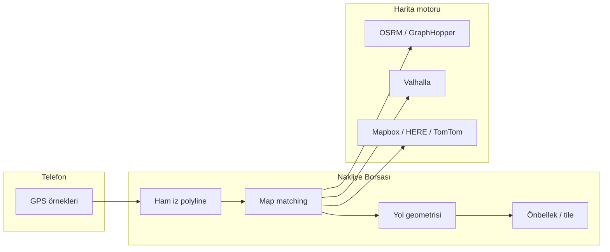

# Yol üzeri rota (map matching) — gelişim planı

## 1. Bugün ne görüyoruz?

Canlı harita (`/hesap/filo/harita`) şu an rotayı şöyle çiziyor:

- Telemetri olaylarından gelen **`LOCATION_SAMPLE`** noktalarını kronolojik sırayla birleştirip **Leaflet `polyline`** ile bağlıyoruz.
- Bu çizgi **kuş uçuşu (geodesic / düz segment)** demektir: iki GPS noktası arasında yol ağı yoktur.

Ekranda Ankara ↔ Antalya arasında tek düz mavi çizgi görmenizin tipik nedenleri:

| Neden | Açıklama |
|--------|-----------|
| **Seyrek GPS** | Web companion ön planda 2–5 sn aralıkla örnek alıyor; uzun mesafede veya sinyal zayıfsa noktalar azalır, segmentler uzar. |
| **Eksik ara noktalar** | Sadece başlangıç + bitiş benzeri 2–3 nokta kalırsa çizgi doğrudan iki şehir arasında görünür. |
| **Yol geometrisi yok** | Backend ve frontend **hiçbir routing / map-matching** motoru kullanmıyor; sadece ham koordinat polyline. |
| **Test / eski veri** | Sunucuda Ankara test noktası + telefon Antalya canlı konumu birleşince uzun kuş uçuşu segment oluşur. |

**Özet:** Sorun harita kütüphanesi değil; **iş mantığında “yol ağına yapıştırma” (map matching) ve “segmentler arası yol routing” adımı eksik.**

---

## 2. Hedef (rakip seviyesi)

Taşıyıcı panelinde şoför için:

1. **Güncel konum** — yol üzerinde veya en fazla ~20–40 m sapmayla (snap).
2. **Geçmiş rota** — sürülen **gerçek koridor** (otoyol/karayolu), kuş uçuşu değil.
3. **Hareket durumu** — duruyor / gidiyor / hızlanıyor / yavaşlıyor (mevcut faz; yol hızı ile iyileştirilecek).
4. **Olaylar** — fren, hız limiti, durak; haritada yol üzerinde işaret.
5. **TR · UA · EU** — bölgesel yol verisi ve veri işleme (GDPR/KVKK) uyumu.

---

## 3. Kavramlar (ekip ortak dili)



| Terim | Ne işe yarar |
|--------|----------------|
| **Ham iz (breadcrumb)** | GPS noktalarının zaman serisi; mevcut sistem. |
| **Map matching** | Noktaları yol ağına “yapıştırma”; sapmayı keser. |
| **Route reconstruction** | İki zaman arasındaki hareketi yol segmentleriyle doldurma. |
| **Snap-to-road (canlı)** | Son konumu en yakın yola taşıma. |
| **HMM / Viterbi** | Çoklu yol adayı arasında en olası yolu seçme (profesyonel telematik). |

---

## 4. Çözüm katmanları (öncelik sırası)

### Faz A — Hızlı iyileştirme (1–2 hafta eşdeğeri iş)

**Amaç:** Aynı veriyle bile görünümü düzeltmek; maliyet düşük.

1. **Polyline sadeleştirme (Ramer–Douglas–Peucker)**  
   - Gereksiz zigzag ve GPS gürültüsünü azalt.  
   - Kuş uçuşunu tam çözmez; görünümü iyileştirir.

2. **Segment başına OSRM `route` (açık kaynak)**  
   - Ardışık GPS çiftleri (veya her 500 m) için `https://router.project-osrm.org` veya **kendi OSRM instance** (VPS/Docker).  
   - Dönen `geometry` (encoded polyline) haritada birleştirilir.  
   - **Dikkat:** Public OSRM demo rate limit; üretimde self-host şart.

3. **Canlı pin: snap-to-road**  
   - Son konum için OSRM `nearest` veya `match` (1 nokta).  
   - Taşıyıcı haritasında araç yol üzerinde görünür.

4. **Veri temizliği**  
   - Hız &lt; 3 km/s ve accuracy &gt; 80 m örnekleri rotaya dahil etme.  
   - Zıplama filtresi (1 sn içinde 2 km → outlier).

**Teslim:** API `routeGeometry` alanı (GeoJSON LineString); harita mavi çizgiyi bununla çizer.

---

### Faz B — Üretim map matching (çekirdek)

**Amaç:** Uzun seferlerde tek parça, tutarlı yol izi.

1. **Self-hosted OSRM veya GraphHopper (EU/TR extract)**  
   - Geofabrik: `turkey-latest.osm.pbf`, `ukraine-latest`, `europe` parçalı.  
   - VPS yeterli değilse ayrı “routing” sunucusu veya managed servis.

2. **Backend işçi: `RouteReconstructionService`**  
   - Girdi: `fleetDriverId`, zaman aralığı.  
   - Çıktı: `matchedRouteId`, GeoJSON, mesafe (km), süre.  
   - İş akışı: ham noktalar → batch `match` API (OSRM Map Matching / GraphHopper `map_match`).  
   - Sonuç **PostgreSQL + PostGIS** `LINESTRING` veya JSONB cache (trip bazlı).

3. **Trip modeli**  
   - `TRIP_START` / `TRIP_END` ile segmentler; her trip için ayrı matched geometry.  
   - Taşıyıcı haritası: “son aktif trip” veya “seçilen 6 saat” için cache’lenmiş yol.

4. **API**  
   - `GET .../drivers/:id/route` → ham noktalar + **`roadGeometry`** (opsiyonel `?mode=matched`).  
   - Arka planda stale ise async job tetikle (BullMQ / cron).

**Teslim:** Ankara–Antalya gibi uzun hatlarda çizgi **karayolu** üzerinden.

---

### Faz C — Hareket / ivme (yol ile birleşik)

**Amaç:** “Hızlanıyor / yavaşlıyor” telefon ivmesi + **yol hız profili**.

1. **Türetilmiş kinematik**  
   - Ardışık matched noktalarda `Δv/Δt`, viraj yarıçapı.  
   - Telefon `HARSH_*` olayları ile çapraz doğrulama.

2. **Yol hız limiti (opsiyonel)**  
   - OSM `maxspeed` veya HERE/TomTom speed limit layer.  
   - `SPEED_EXCEEDED` olaylarını limit ile zenginleştir.

3. **UI**  
   - Rota üzerinde renk gradyanı (yeşil → kırmızı hız).  
   - Duraklar: mavi; sert fren: kırmızı işaret (mevcut altyapı genişletilir).

---

### Faz D — Global ölçek ve rekabet

| Bileşen | Seçenek |
|---------|---------|
| Routing TR/UA/EU | Self-host OSRM/Valhalla + bölge shard |
| Rusya / Orta Asya | Ayrı extract veya TomTom/HERE sözleşmesi |
| Native sürücü app | 1–3 Hz GPS, arka plan, Core Motion |
| Ölçek | Event stream → Kafka → matcher workers |
| SLA | Matcher cache TTL; canlı pin &lt; 5 sn gecikme |

**Ticari alternatifler (hızlı entegrasyon, maliyetli):**  
Mapbox Map Matching API, Google Roads API, HERE Map Matching, TomTom Snap to Roads.

---

## 5. Önerilen mimari (Nakliye Borsası)

```
[fleet_telemetry_events]  (ham GPS)
        │
        ▼
[RouteMatchingJob]  ← cron / trip_end / her 50 nokta
        │
        ├── OSRM match (batch)
        └── geometry → [fleet_matched_routes]
                              │
GET /carrier/drivers/:id/route ──► roadGeometry (GeoJSON)
                              │
[Leaflet] polyline + speed gradient
```

**Yeni tablolar (öneri):**

- `fleet_matched_routes` — `driverId`, `tripCorrelationId`, `geometry` (PostGIS), `sourcePointCount`, `matchedAt`, `provider` (`OSRM` | `GRAPHHOPPER` | …).
- `fleet_route_matching_jobs` — durum, hata, yeniden deneme.

**Gizlilik:** Ham GPS işleme amacı açık rıza metninde; matcher’a giden koordinatlar **veri işleyici** (OSRM self-host = sizin sunucunuz; üçüncü taraf API = DPA gerekir).

---

## 6. Frontend değişiklikleri

| Adım | İş |
|------|-----|
| 1 | `polyline` yerine `roadGeometry` çiz (tek veya birleştirilmiş LineString). |
| 2 | Ham noktaları ince gri “GPS ham iz” (debug) opsiyonel katman. |
| 3 | Yükleniyor: “Yol hesaplanıyor…” (matcher async ise). |
| 4 | Uzun rota: viewport’a `fitBounds` matched geometry üzerinden. |

---

## 7. Altyapı / DevOps

1. **Docker Compose (routing profile)**  
   - `osrm-backend` extract + `osrm-routed` (TR önce, sonra UA).  
   - RAM: TR extract ~2–4 GB+ (sürüme göre).

2. **VPS 168.231.109.27**  
   - API aynı kalır; matcher ayrı container veya managed API.  
   - Nginx timeout: match istekleri 10–30 sn sürebilir → **async job** tercih.

3. **İzleme**  
   - Matcher başarı oranı, ortalama sapma (m), job kuyruğu derinliği.

---

## 8. Kabul kriterleri (test)

1. Şoför İstanbul içi 30 dk sürüş → çizgi **cadde/otoyol** üzerinde; kuş uçuşu köprü/ deniz kesmesi yok (GPS sapması hariç).  
2. Ankara → Antalya canlı takip → çizgi **D200/E90** koridoruna yakın (matcher + yeterli nokta).  
3. Durduğunda rota son noktada biter; “0 km/s · Duruyor” ile uyumlu.  
4. 6 saatlik pencerede API yanıt &lt; 2 sn (cache hit) veya 202 + poll (cache miss).  
5. GDPR: üçüncü taraf matcher kullanılıyorsa sözleşme ve opt-in metni güncel.

---

## 9. Önerilen uygulama sırası (bu repo)

| Sıra | İş paketi | Branch / modül |
|------|-----------|----------------|
| 1 | GPS filtre + polyline simplify | `telematics` |
| 2 | OSRM self-host (TR) + `snap` canlı pin | `infra` + API |
| 3 | `RouteReconstructionService` + `roadGeometry` API | `telematics` |
| 4 | Harita UI: yol çizgisi + hız gradyanı | `web` |
| 5 | UA/EU extract + trip cache | `telematics` |
| 6 | Native app yüksek frekans GPS | mobil (ayrı proje) |

---

## 10. Maliyet / risk özeti

| Yaklaşım | Maliyet | Risk |
|----------|---------|------|
| Self-host OSRM | Sunucu RAM/CPU | Bakım, extract güncelleme |
| GraphHopper Cloud / HERE | API €/1000 istek | Vendor lock, DPA |
| Sadece polyline | Sıfır | **Kuş uçuşu kalır** — kabul edilmez |

---

## 11. İlgili mevcut kod

- Ham rota: `TelemetryApplicationService.getCarrierDriverRoute`  
- Harita: `FleetLiveMapCanvas.tsx` (`L.polyline` ham noktalar)  
- Telemetri ingest: `TelemetryIngestController`  
- Mimari: `docs/TELEMATICS_ARCHITECTURE.md`

---

**Sonraki adım (onayınızla):** Faz A — TR OSRM Docker + `roadGeometry` alanı ve canlı pin snap; ardından Faz B trip cache.
